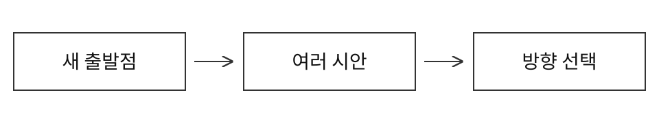
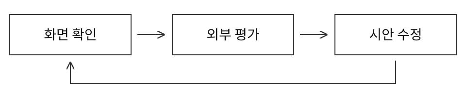
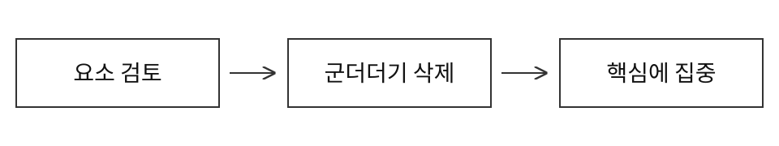

## 여러 방향을 살펴보는 아이디어 탐색

서로 다른 시안을 먼저 비교한다. 무작위 문자열이나 구체적인 상상으로 출발점을 바꾸고, 마음에 드는 방향에 자신의 취향을 더한다.

---

## 선택한 방향을 살리는 디자인 구체화

별도 에이전트가 화면을 보고 평가하게 한다. 평가를 바탕으로 시안을 고치고, 필요한 이미지와 움직임을 더해 디자인의 개성을 살린다.

---

## 불필요한 요소를 덜어내는 마무리

화면에서 꼭 필요한 것부터 가려낸다. 과한 장식과 반복되는 설명을 줄이고, 사용자가 해야 할 일에 집중할 수 있도록 정리한다.

