# guide1.mov 한국어 노트

`guide/guide1.mov`는 YouTube 영상 [Here's How to Give Claude an Eye for Design (6 easy steps)](https://www.youtube.com/watch?v=1Y8OlBgafdE)의 도입부 일부를 화면 녹화한 35.4초 길이의 클립입니다. 클립에는 오디오가 없고, 내용은 화면 아래의 한국어 자막과 슬라이드의 영어 문구로 전달됩니다.

이 노트에는 클립의 자막과 화면 문구를 장면 순서대로 정리했습니다. 또 클립 자막을 원본 영상의 영어 자동 자막 및 영상 설명과 대조해서, 원래 내레이션과 뜻이 다른 부분을 표시했습니다. 클립 앞뒤에서 잘린 내레이션은 내용을 요약해 넣었습니다.

## 원본 영상과 클립의 위치

| 항목 | 내용 |
| --- | --- |
| 원본 | [Here's How to Give Claude an Eye for Design (6 easy steps)](https://www.youtube.com/watch?v=1Y8OlBgafdE) |
| 채널 | The AI Automators |
| 게시일 | 2026년 9월 7일 |
| 길이 | 18분 2초 |
| 클립 구간 | YouTube 약 0:07.6~0:43.1 |
| 노트 범위 | YouTube 0:00~0:49.4 (클립 앞뒤에서 잘린 문장 포함) |

클립 구간은 두 가지 근거로 계산했습니다. 첫째, 클립 4.0~4.65초에 YouTube 플레이어 컨트롤이 잠깐 보이는데, 클립 4.30초에 재생 위치가 `0:11 / 18:01`에서 `0:12 / 18:01`로 바뀝니다. 따라서 클립 4.30초는 YouTube 0:12.0 무렵에 해당합니다. 둘째, 슬라이드에 단어가 나타나는 순간은 영어 자동 자막에 기록된 그 단어의 발화 시각과 일정한 간격을 두고 대응합니다. 예를 들어 NOT A, MIND, READER는 내레이션에서 각 단어를 말할 때 하나씩 튀어나옵니다. 이런 지점 12곳에서 잰 시차는 7.45~7.99초이고, 중앙값은 7.64초입니다. 그래서 이 노트의 YouTube 시각은 클립 시각에 7.6초를 더한 값이며, 0.4초 안팎의 오차가 있을 수 있습니다.

이 구간은 영상의 첫 챕터인 `Design Inspiration`(0:00~3:05)에 속합니다. 원본 영상 파일은 내려받기가 차단되어서, 클립에 없는 구간(0:00~0:07.6, 0:43.1~0:49.4)의 화면은 직접 확인하지 못했습니다. 다만 약 10초 간격의 저해상도 미리보기인 YouTube 스토리보드에서, 0:00에는 발표자만 화면에 나오고 0:49에는 SOUTHSIDE BREWING 사이트가 화면 전체에 나온다는 점은 확인했습니다.

## 표기 기준

- 클립 자막은 화면에 표시된 문장을 그대로 옮겼습니다. 다만 `모델 들은`, `것 입니다`처럼 붙여 써야 할 곳을 띄어 쓴 부분만 바로잡았습니다.
- 원래 내레이션은 YouTube의 영어 자동 자막(단어별 시각 포함)과 영상 설명으로 확인했습니다. 클립 자막의 뜻이 원래 내레이션과 다른 부분에는 영어 원문의 해당 구절을 함께 적었습니다.
- 화면 문구는 번역과 함께 원문을 적었습니다. 사이트 이름, 브랜드 이름, 모델 이름은 번역하지 않았습니다.
- 다른 요소에 가려지거나 잘린 문구는 보이는 부분까지만 적고 `…`로 표시했습니다. 글자가 너무 작거나 흐려서 판독이 불확실한 문구는 넣지 않았습니다. 대부분 읽히고 일부만 흐린 문구는 넣되, 참고 칸에 그 사실을 적었습니다.
- 장면 제목에는 클립 시각과 YouTube 시각을 함께 적었습니다. 본문과 표에서 `4.30초`처럼 초로만 적은 시각은 클립 시각이고, `0:05.8`처럼 분과 초로 적은 시각은 YouTube 시각입니다. 장면 경계에는 0.05초 안팎의 오차가 있을 수 있습니다.
- 이미지는 클립의 원본 프레임을 그대로 쓰거나 잘라 내어 `assets/guide1-mov/`에 저장했습니다. 바로 아래의 장면별 캡처 미리보기만 프레임을 축소하고 라벨을 붙여 만들었습니다. 전체 목록은 [에셋 목록](#에셋-목록)에 있습니다.

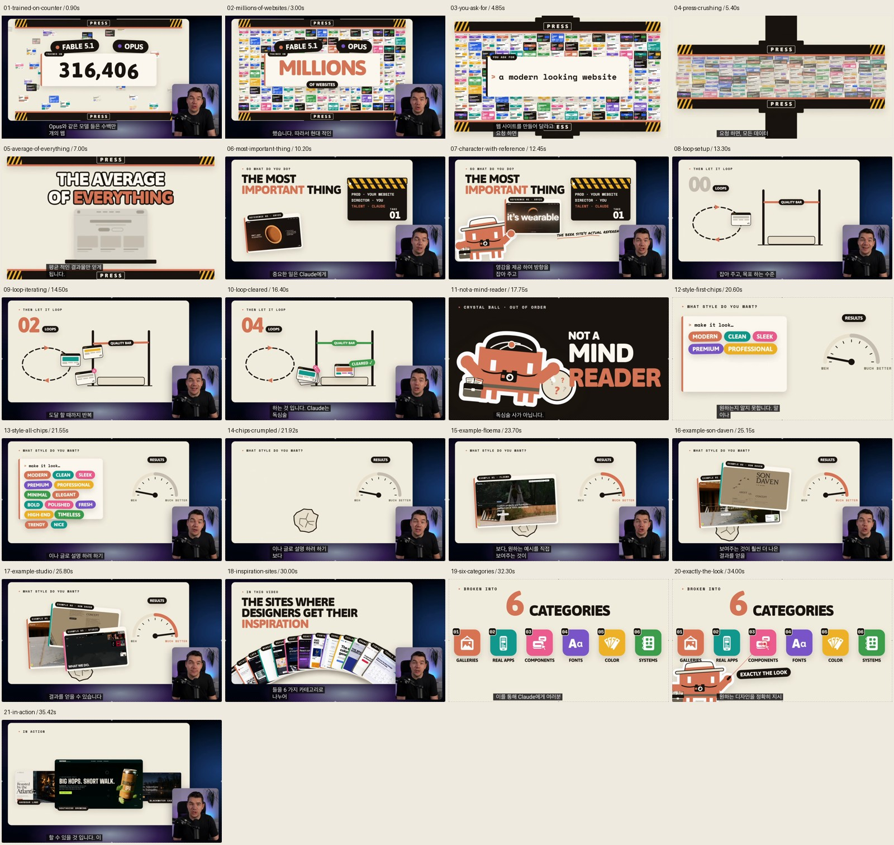

## 클립 자막

자막은 두 줄로 표시되고 새 줄이 생길 때마다 한 줄씩 위로 밀려 올라가기 때문에 앞뒤 문장의 표시 구간이 겹칩니다. 표시 구간은 클립 시각입니다.

| 번호 | 표시 구간 | 자막 |
| --- | --- | --- |
| 1 | 00.00~04.18초 | Opus와 같은 모델들은 수백만 개의 웹사이트를 학습했습니다. |
| 2 | 02.45~08.87초 | 따라서 현대적인 웹사이트를 만들어 달라고 요청하면, 모든 데이터의 평균적인 결과물만 얻게 됩니다. |
| 3 | 07.15~17.20초 | 그렇기 때문에 여러분이 할 수 있는 가장 중요한 일은 Claude에게 디자인 영감을 제공하여 방향을 잡아 주고, 목표하는 수준에 도달할 때까지 반복하게 하는 것입니다. |
| 4 | 15.73~18.72초 | Claude는 독심술사가 아닙니다. |
| 5 | 17.82~21.45초 | 여러분이 어떤 스타일을 원하는지 알지 못합니다. |
| 6 | 20.33~27.53초 | 말이나 글로 설명하려 하기보다, 원하는 예시를 직접 보여주는 것이 훨씬 더 나은 결과를 얻을 수 있습니다. |
| 7 | 25.98~35.45초 | 이번 영상에서는 디자이너들이 영감을 얻는 사이트들을 6가지 카테고리로 나누어 소개할 예정이며, 이를 통해 Claude에게 여러분이 원하는 디자인을 정확히 지시할 수 있을 것입니다. |
| 8 | 35.27~35.45초 | 이… |

- 클립 첫 프레임에 이미 `Opus와 같은 모델 들은`이 표시되어 있습니다. 원래 문장은 이보다 앞선 YouTube 0:05.8에 시작합니다.
- 8번은 다음 문장의 첫 글자이며, 클립이 이 글자에서 끝납니다.

## 원래 내레이션과 비교

번호는 위의 클립 자막 번호와 같습니다. 0번 문장 전체와 8번 문장에서 `이…` 뒤에 이어지는 부분은 클립에 없는 내레이션입니다.

| 번호 | YouTube 시각 | 원래 내레이션과 비교한 내용 |
| --- | --- | --- |
| 0 | 0:00.0~0:05.4 | 클립 앞에서 잘린 문장입니다. 발표자는 Claude가 보기 좋은 웹사이트를 만들 수는 있지만, 근본적으로는 뛰어난 디자인이 무엇인지 모른다고 말합니다. |
| 1 | 0:05.8~0:10.0 | 원래 문장에서는 `Fable 5.1 and Opus`라고 두 모델을 함께 언급합니다. 클립 첫 프레임의 자막에는 Opus만 보입니다. 발표자가 Fable 5.1을 말하는 시점은 클립이 시작되기 직전이므로, 자막에서도 이 부분이 클립 앞에서 잘렸을 가능성이 큽니다. 화면의 FABLE 5.1 배지와 OPUS 배지가 이 두 모델을 나타냅니다. |
| 2 | 0:10.4~0:14.2 | 원문에서는 1번과 2번이 쉼표로 이어진 한 문장입니다. 결과를 가리키는 원래 표현은 `the average of everything`이며, 화면 제목 THE AVERAGE OF EVERYTHING과 같습니다. 자막의 '데이터'와 '만'은 원문에 없는 말이므로, 원문에 가깝게 옮기면 '모든 것의 평균을 얻게 됩니다'가 됩니다. |
| 3 | 0:14.5~0:23.7 | `direct Claude`는 감독이 배우를 연출하듯 Claude를 지휘한다는 뜻이며, 슬레이트의 DIRECTOR 칸도 같은 비유를 그림으로 보여 줍니다. 자막의 '방향을 잡아 주고'에는 이 비유가 드러나지 않습니다. `loop until it hits that quality bar`는 화면의 THEN LET IT LOOP, QUALITY BAR와 같은 단어를 쓰므로, 자막의 '목표하는 수준'은 화면의 품질 기준선을 가리킵니다. |
| 4 | 0:24.0~0:25.4 | 원문과 뜻이 같습니다. |
| 5 | 0:25.6~0:27.2 | 원문과 뜻이 같습니다. 원문에서는 4번과 5번이 쉼표로 이어진 한 문장입니다. |
| 6 | 0:27.6~0:33.3 | 원문에서 더 나은 결과를 얻는 주체는 '여러분'입니다. 자막의 '보여주는 것이 … 결과를 얻을 수 있습니다'는 주어와 서술어가 맞지 않으므로, '예시를 보여 주면 훨씬 더 나은 결과를 얻을 수 있습니다'로 읽으면 원문의 뜻과 맞습니다. |
| 7 | 0:33.6~0:42.6 | `point Claude at exactly the look that you want`는 원하는 모습을 정확히 가리켜서 Claude가 그 모습을 겨냥하게 한다는 뜻입니다. 화면의 레이저 포인터와 EXACTLY THE LOOK 라벨이 이 표현을 그림으로 옮긴 것입니다. 자막의 '정확히 지시'도 같은 뜻으로 읽을 수 있습니다. |
| 8 | 0:42.9~0:49.4 | 클립 뒤에서 잘린 문장입니다. 발표자는 이 방법을 실제로 적용한 사례로 이 영상을 위해 직접 만든 랜딩 페이지 세 개를 보여 주겠다고 말하고, 세 페이지 모두 Fable 5.1로 만들었다고 덧붙입니다. |

## 장면별 내용

### 0. 도입 (클립에 없음, YouTube 0:00~0:07.6)

YouTube 스토리보드를 보면 0:00에는 발표자만 화면에 나옵니다. 발표자는 Claude가 보기 좋은 웹사이트를 만들 수는 있지만 뛰어난 디자인이 무엇인지는 모른다고 말하며 영상을 시작합니다. 0:05.8부터는 Fable 5.1과 Opus 같은 모델이 수백만 개의 웹사이트로 학습했다는 문장이 이어지고, 클립은 이 문장의 중간인 0:07.6에서 시작합니다.

### 1. 수백만 개의 웹사이트로 학습한 모델 (클립 00.00~03.15초, YouTube 0:07.6~0:10.8)

> Opus와 같은 모델들은 수백만 개의 웹사이트를 학습했습니다.

위아래에 경고 줄무늬가 칠해진 프레스 기계가 베이지색 슬라이드를 감싸고 있습니다. 작은 웹사이트 썸네일이 사방에서 날아들어 프레스 안을 빈틈없이 채우고, 가운데 카드의 학습량 숫자가 빠르게 올라갑니다. 1.4초에 숫자가 `MILLIONS`로 바뀌고, 2.4초에 카드 아래에 `OF WEBSITES` 칩이 붙습니다. 클립 첫 프레임에는 FABLE 5.1 배지가 이미 떠 있고, OPUS 배지는 0.1초에 나타납니다. 이 순간은 내레이션에서 Opus를 말하는 YouTube 0:07.8과 맞습니다.

| 화면 원문 | 번역 | 참고 |
| --- | --- | --- |
| PRESS | 프레스 | 프레스 기계의 위아래 판에 붙은 이름표입니다. |
| FABLE 5.1 / OPUS | FABLE 5.1 / OPUS | 모델 이름 배지입니다. |
| TRAINED ON 024,414 → 118,164 → 316,406 … | 학습 데이터 024,414 → 118,164 → 316,406 … | 숫자가 슬롯머신처럼 굴러가며 올라갑니다. |
| TRAINED ON MILLIONS OF WEBSITES | 수백만 개의 웹사이트로 학습 | 카운터가 멈춘 뒤의 최종 문구입니다. |

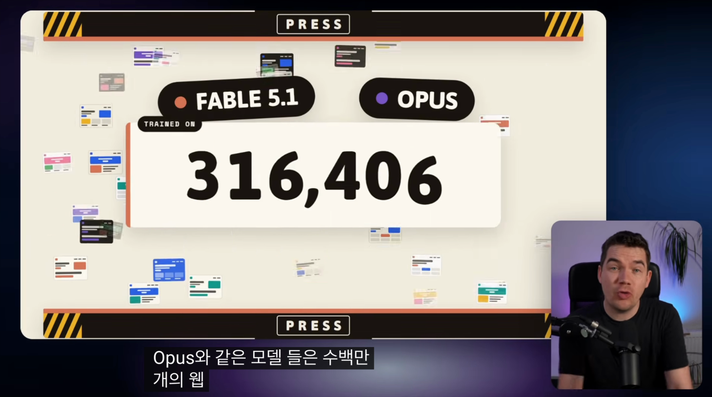

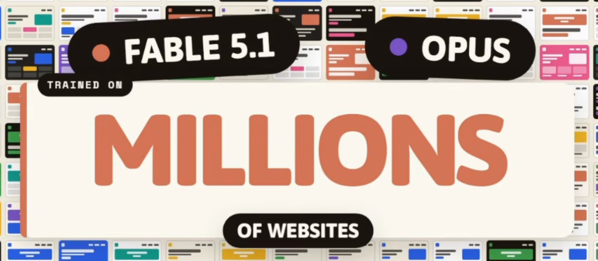

### 2. 현대적인 웹사이트를 요청하면 (클립 03.15~05.75초, YouTube 0:10.8~0:13.3)

> 따라서 현대적인 웹사이트를 만들어 달라고 요청하면,

학습량 카드가 뒤집히면서 `YOU ASK FOR` 입력 카드로 바뀌고, 프롬프트가 한 글자씩 입력됩니다. 입력이 거의 끝나 가는 4.5~4.8초에 화면이 프레스 안쪽으로 확대됩니다. 입력 카드가 사라진 뒤에는 위아래 판이 서로 다가가 웹사이트 썸네일을 납작하게 짓누릅니다.

| 화면 원문 | 번역 | 참고 |
| --- | --- | --- |
| YOU ASK FOR | 여러분이 요청하는 것 | 입력 카드의 탭입니다. |
| > a modern looking website | > 현대적인 느낌의 웹사이트 | 3.55초부터 한 글자씩 입력되어 4.75초에 완성됩니다. |

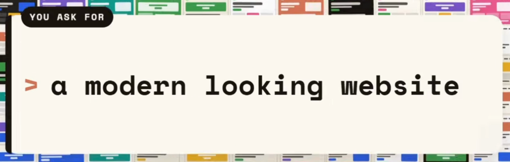

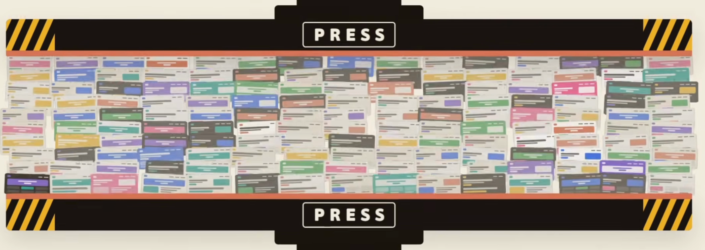

### 3. 모든 것의 평균 (클립 05.75~07.53초, YouTube 0:13.3~0:15.1)

> 모든 데이터의 평균적인 결과물만 얻게 됩니다.

프레스가 다시 벌어지면서, 납작하게 눌려 가는 띠가 된 썸네일이 흐릿한 회색 웹사이트 목업으로 부풀어 오릅니다. 목업은 로고, 메뉴, 제목, 버튼, 카드 세 개로 이루어진 전형적인 랜딩 페이지 형태이며 일부러 흐리게 처리되어 있습니다. 목업 위로 큰 제목이 튀어나옵니다.

| 화면 원문 | 번역 | 참고 |
| --- | --- | --- |
| THE AVERAGE OF EVERYTHING | 모든 것의 평균 | EVERYTHING만 주황색입니다. |

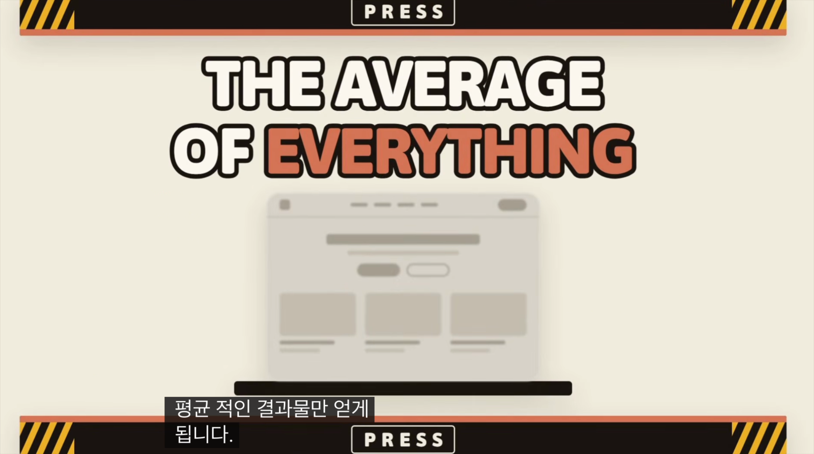

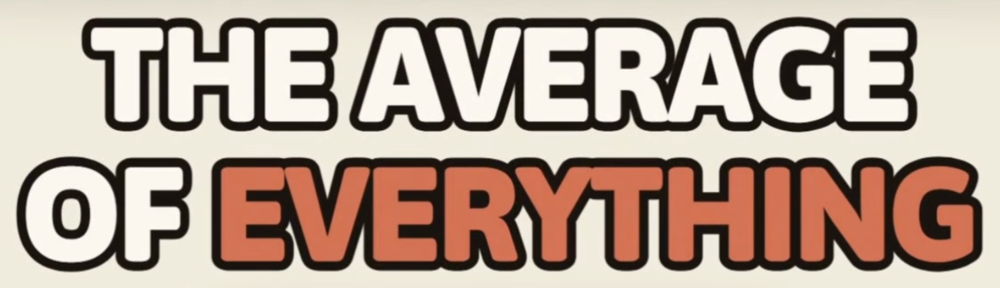

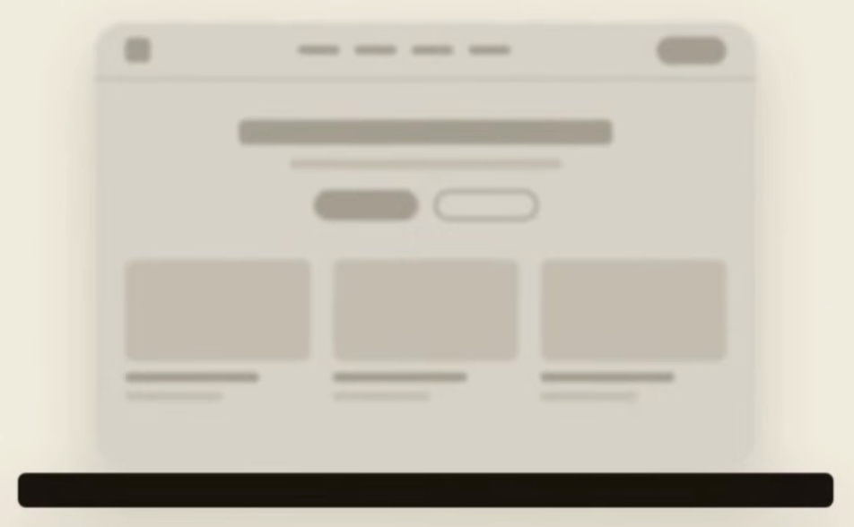

### 4. 가장 중요한 것: 방향을 정하는 사람 (클립 07.53~12.53초, YouTube 0:15.1~0:20.1)

> 그렇기 때문에 여러분이 할 수 있는 가장 중요한 일은 Claude에게 디자인 영감을 제공하여 방향을 잡아 주고,

영화 촬영용 슬레이트에 작품, 감독, 출연 칸이 차례로 채워집니다. 9.7초에 감독 칸이 추가되고 클랩스틱이 닫히며, 10.1초에 출연 칸이 주황색으로 추가됩니다. 왼쪽 아래의 레퍼런스 카드에서는 컵받침 제품 사이트 ORYZO의 화면이 영상처럼 재생됩니다. 11초쯤에는 모자를 쓰고 카메라를 멘 주황색 사각형 캐릭터가 들어와 ORYZO 카드를 들어 올리고, 카드 옆에 손글씨 주석이 나타납니다. 감독 칸과 출연 칸은 내레이션에서 각각 `direct`와 `Claude`를 말하는 순간에 나타납니다.

| 화면 원문 | 번역 | 참고 |
| --- | --- | --- |
| SO WHAT DO YOU DO? | 그럼 어떻게 해야 할까요? | |
| THE MOST IMPORTANT THING | 가장 중요한 것 | IMPORTANT만 주황색입니다. |
| PROD · YOUR WEBSITE | 작품: 여러분의 웹사이트 | 슬레이트의 작품명 칸입니다. |
| DIRECTOR · YOU | 감독: 여러분 | 9.7초에 추가됩니다. |
| TALENT · CLAUDE | 출연: Claude | 10.1초에 추가됩니다. |
| TAKE 01 | 테이크 01 | |
| REFERENCE 01 · ORYZO | 레퍼런스 01: ORYZO | 레퍼런스 카드의 탭입니다. |
| DESIGNED BY LUSION, THE AWARD-WINNING DESIGN STUDIO. | 수상 경력이 있는 디자인 스튜디오 Lusion이 디자인했습니다. | ORYZO 첫 화면의 작은 문구이며 일부가 흐립니다. |
| Designed to lift, insulate, and grip in all the right ways. Oryzo makes the simplest moment feel considered. | 모든 면에서 알맞게 받쳐 주고, 열을 막아 주고, 미끄러지지 않게 잡아 주도록 설계했습니다. Oryzo는 가장 단순한 순간에도 세심한 배려가 느껴지게 합니다. | ORYZO 첫 화면의 작은 설명이며 일부가 흐립니다. |
| ISN'T JUST A COASTER. | 그냥 컵받침이 아닙니다. | 8.25초부터 표시됩니다. |
| Oryzo isn't just a coaster. It's the result of unprecedented AI* breakthroughs. | Oryzo는 그냥 컵받침이 아닙니다. 전례 없는 AI* 기술 혁신이 만들어 낸 결과물입니다. | AI 뒤에 작은 별표가 붙어 있습니다. |
| SO PORTABLE, it's wearable | 휴대하기 정말 좋아서, 착용할 수도 있습니다 | 캐릭터가 카드를 들어 올린 뒤의 화면입니다. |
| THE BEER SITE'S ACTUAL REFEREN… | 맥주 사이트의 실제 레퍼런… | 오른쪽 끝이 웹캠에 가려 `REFEREN`까지만 보입니다. 맥주 사이트는 장면 11의 SOUTHSIDE BREWING으로 보입니다. |

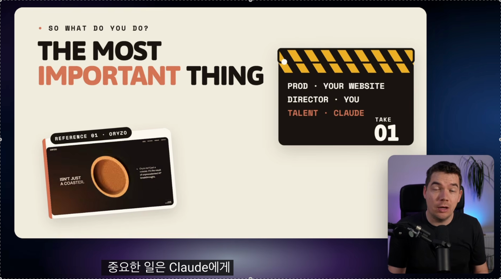

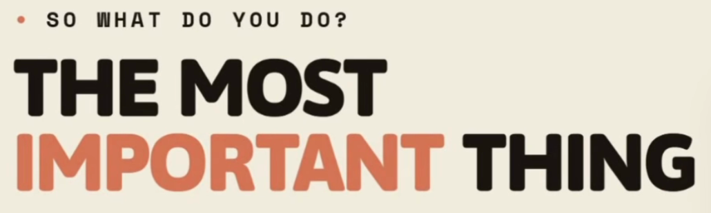

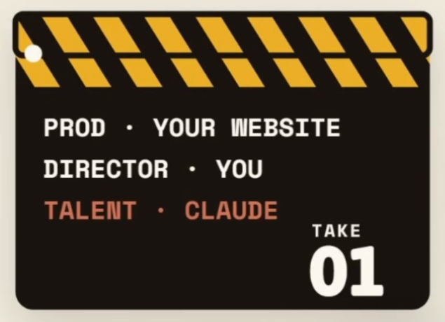

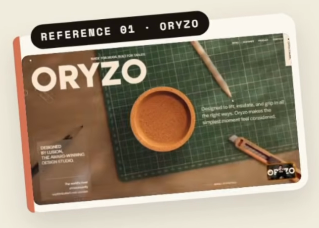

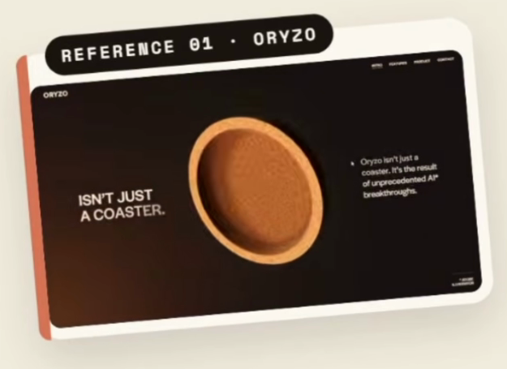

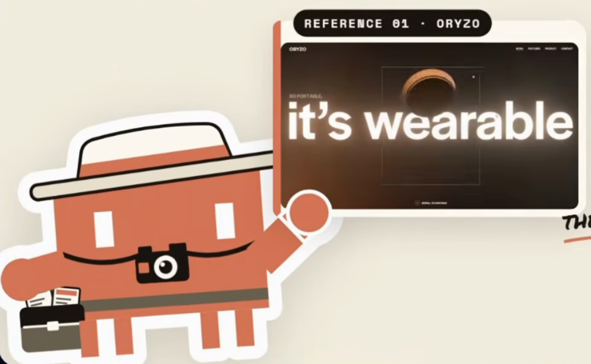

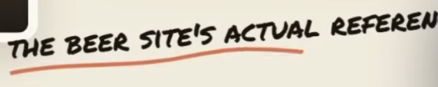

### 5. 품질 기준에 도달할 때까지 반복 (클립 12.53~16.57초, YouTube 0:20.1~0:24.2)

> 목표하는 수준에 도달할 때까지 반복하게 하는 것입니다.

점선 타원으로 그린 반복 루프에서 버전 카드가 하나씩 만들어지고, 높이뛰기 가로대처럼 생긴 품질 기준선에 차례로 도전합니다. v1부터 v3까지는 가로대에 부딪혀 떨어지고, 탈락한 카드는 분홍색 X 표시와 함께 왼쪽 기둥 아래에 쌓입니다. 반복 횟수가 04가 되자 v4가 가로대를 넘고, 가로대가 초록색으로 바뀌며 통과 배지가 붙습니다.

| 화면 원문 | 번역 | 참고 |
| --- | --- | --- |
| THEN LET IT LOOP | 그다음 반복하게 하세요 | |
| 00 LOOPS → 04 LOOPS | 반복 0회 → 반복 4회 | 13.6초, 14.1초, 14.6초, 15.1초에 하나씩 올라갑니다. |
| QUALITY BAR | 품질 기준선 | 가로대에 붙은 라벨입니다. |
| v1 / v2 / v3 / v4 | 버전 1 / 버전 2 / 버전 3 / 버전 4 | |
| CLEARED ✓ | 통과 ✓ | 15.8초에 v4 카드에 붙습니다. |

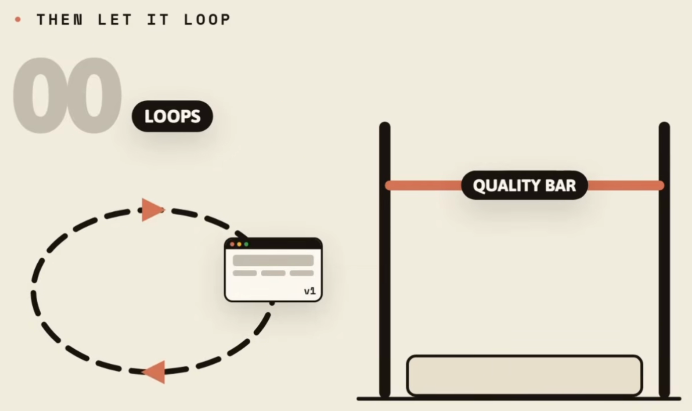

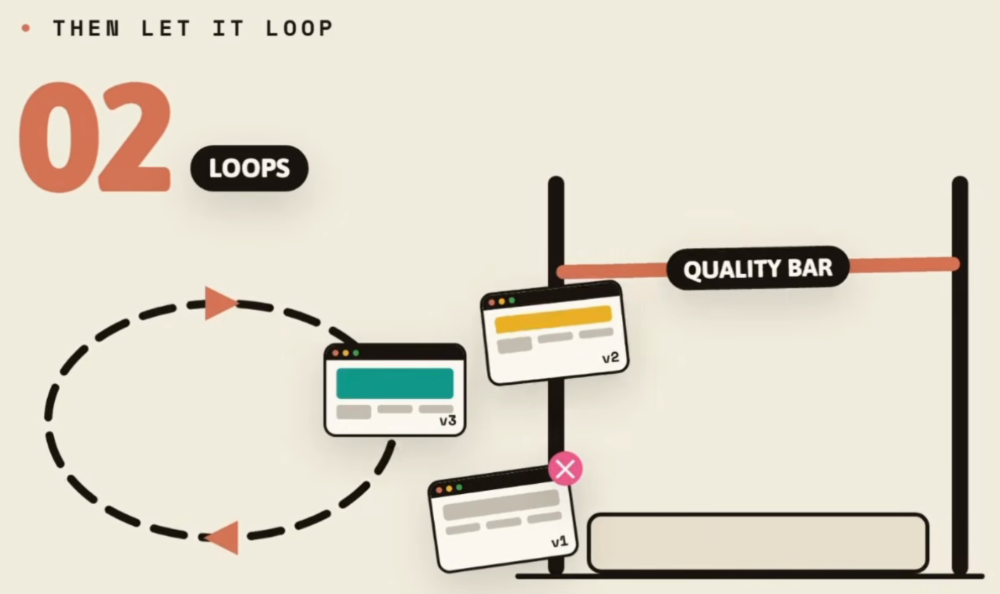

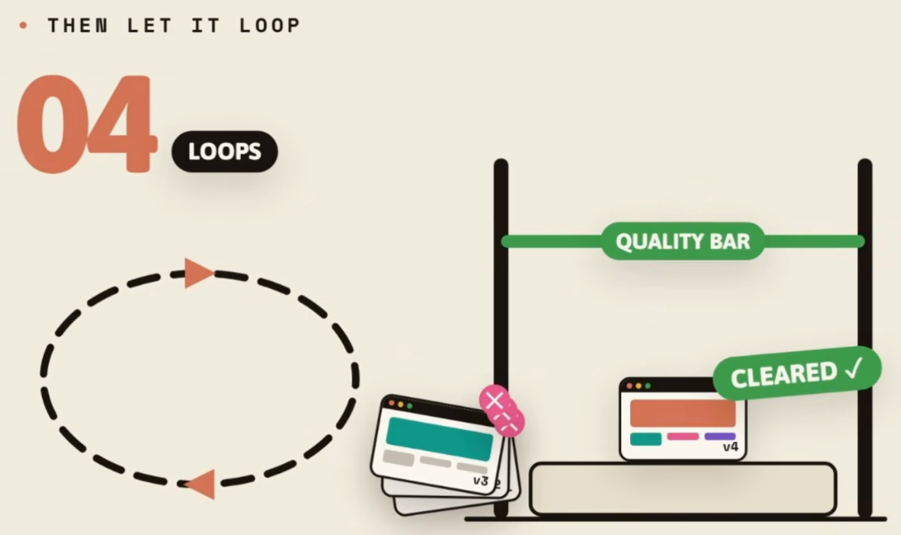

### 6. 독심술사가 아닙니다 (클립 16.57~18.33초, YouTube 0:24.2~0:25.9)

> Claude는 독심술사가 아닙니다.

어두운 슬라이드가 화면 전체로 커지고 웹캠이 사라집니다. 왼쪽에는 검은 모자를 쓴 주황색 캐릭터가 두 팔을 벌리고 서 있고, 옆에는 물음표가 가득 찬 수정 구슬이 있습니다. 오른쪽 제목은 한 단어씩 튀어나옵니다.

| 화면 원문 | 번역 | 참고 |
| --- | --- | --- |
| CRYSTAL BALL · OUT OF ORDER | 수정 구슬: 고장 남 | 왼쪽 위 라벨입니다. |
| NOT A MIND READER | 독심술사가 아닙니다 | READER만 주황색입니다. |

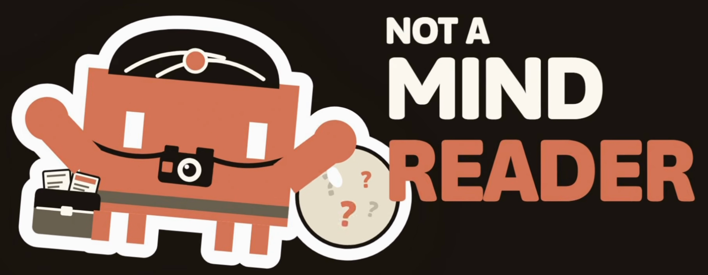

### 7. 어떤 스타일을 원하나요? (클립 18.33~22.18초, YouTube 0:25.9~0:29.8)

> 여러분이 어떤 스타일을 원하는지 알지 못합니다. 말이나 글로 설명하려 하기보다,

왼쪽 프롬프트 카드에 스타일을 나타내는 형용사 칩이 하나씩 쌓이고, 오른쪽 결과 게이지의 바늘은 MEH에 머뭅니다. 칩은 14개까지 늘어나고 마지막 두 개는 카드 밖으로 넘칩니다. 그래도 바늘은 움직이지 않으며, 카드는 21.6초에 구겨진 종이 뭉치가 되어 아래로 떨어집니다.

| 화면 원문 | 번역 | 참고 |
| --- | --- | --- |
| WHAT STYLE DO YOU WANT? | 어떤 스타일을 원하나요? | 왼쪽 위 라벨입니다. |
| > make it look… | > …해 보이게 만들어 줘 | 프롬프트 카드의 첫 줄입니다. |
| RESULTS | 결과 | 게이지 위의 라벨입니다. |
| MEH / MUCH BETTER | 그저 그럼 / 훨씬 나음 | 게이지 양 끝의 라벨입니다. |

형용사 칩은 다음 순서로 나타납니다. 13번 TRENDY와 14번 NICE는 같은 프레임에서 함께 나타납니다.

| 순서 | 화면 원문 | 번역 |
| --- | --- | --- |
| 1 | MODERN | 현대적인 |
| 2 | CLEAN | 깔끔한 |
| 3 | SLEEK | 매끈한 |
| 4 | PREMIUM | 프리미엄 |
| 5 | PROFESSIONAL | 전문적인 |
| 6 | MINIMAL | 미니멀한 |
| 7 | ELEGANT | 우아한 |
| 8 | BOLD | 대담한 |
| 9 | POLISHED | 잘 다듬어진 |
| 10 | FRESH | 산뜻한 |
| 11 | HIGH-END | 고급스러운 |
| 12 | TIMELESS | 유행을 타지 않는 |
| 13 | TRENDY | 트렌디한 |
| 14 | NICE | 괜찮은 |

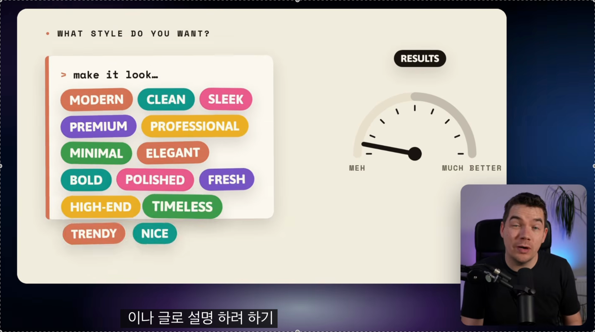

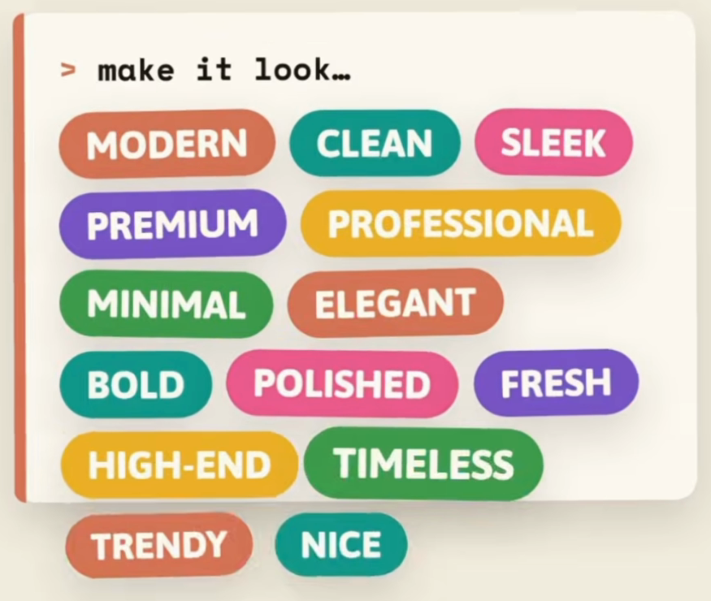

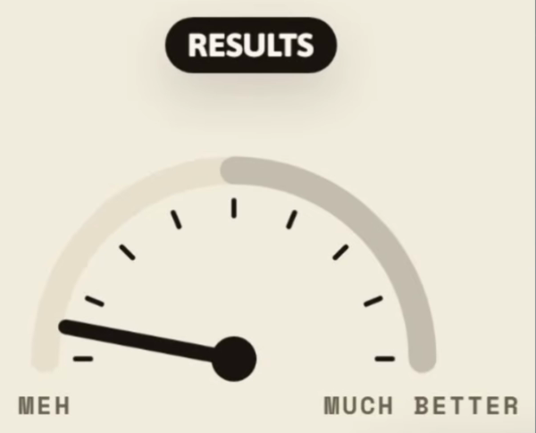

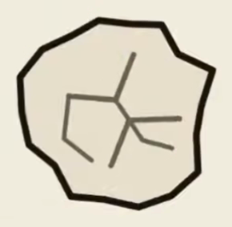

### 8. 예시를 보여 주면 결과가 좋아집니다 (클립 22.18~25.88초, YouTube 0:29.8~0:33.5)

> 원하는 예시를 직접 보여주는 것이 훨씬 더 나은 결과를 얻을 수 있습니다.

형용사 대신 실제 웹사이트 스크린샷 카드가 날아 들어옵니다. 그러자 게이지의 오른쪽 절반과 MUCH BETTER 라벨이 주황색으로 바뀌고, 바늘이 오른쪽 끝으로 돌아갑니다. 이어서 SON DAVEN과 STUDIO 카드가 겹쳐 쌓입니다. 각 카드 안의 사이트 화면은 영상처럼 움직입니다.

| 화면 원문 | 번역 | 참고 |
| --- | --- | --- |
| EXAMPLE 01 · FLOEMA | 예시 01: FLOEMA | |
| Custom projects and furniture crafted out of 100% recyclable plastic | 100% 재활용 가능한 플라스틱으로 만든 맞춤 프로젝트와 가구 | FLOEMA 사이트의 제목입니다. |
| EXAMPLE 02 · SON DAVEN | 예시 02: SON DAVEN | |
| ABOUT US / CONCEPT | 회사 소개 / 콘셉트 | SON DAVEN 사이트의 섹션 제목입니다. |
| EXAMPLE 03 · STUDIO | 예시 03: STUDIO | |
| WHAT WE DO. | 우리가 하는 일. | STUDIO 사이트의 문구입니다. |

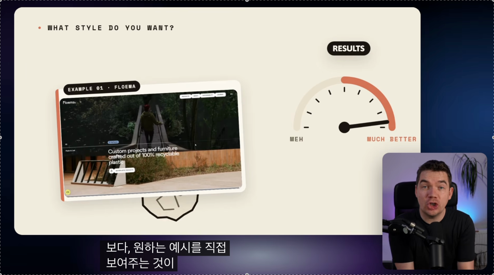

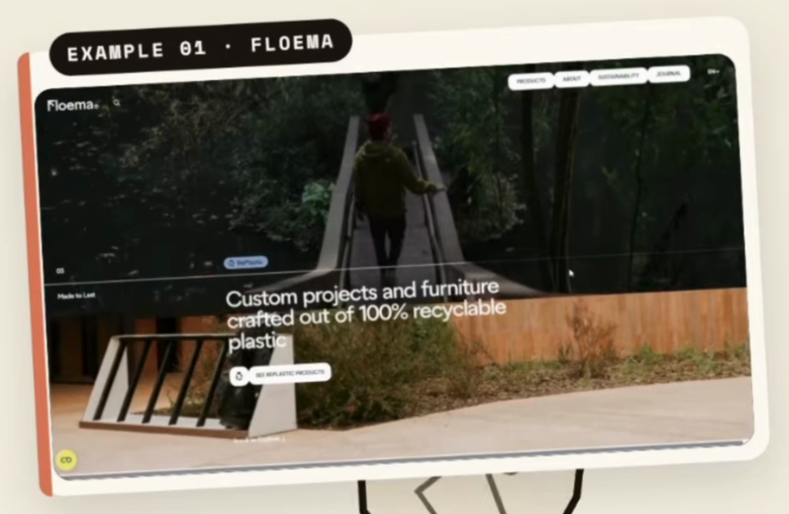

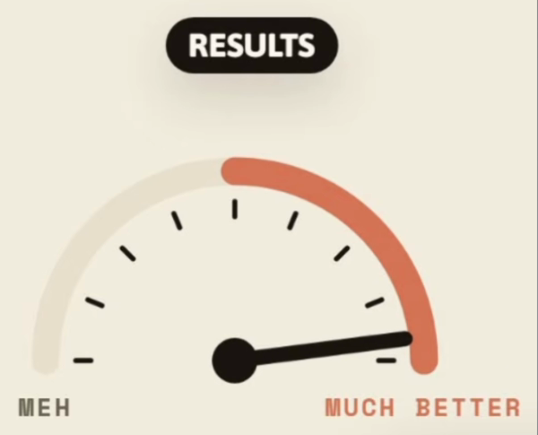

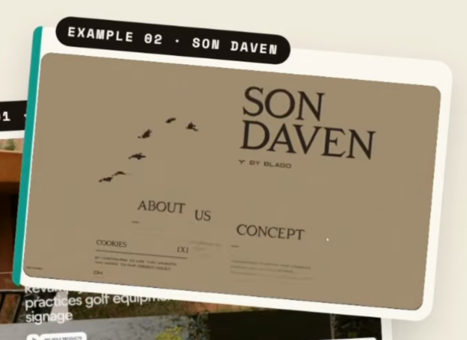

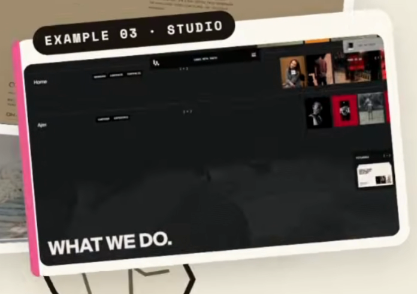

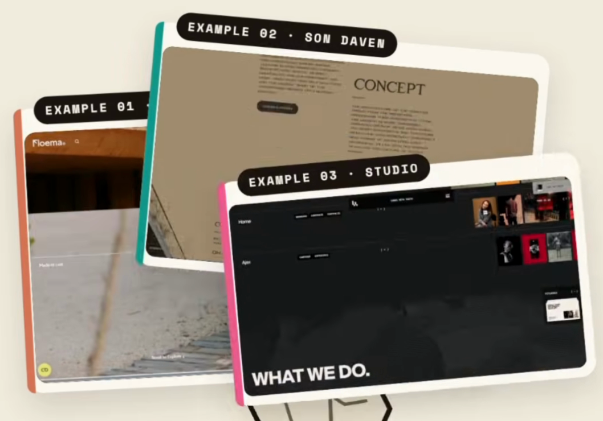

### 9. 디자이너들이 영감을 얻는 사이트 (클립 25.92~30.47초, YouTube 0:33.5~0:38.1)

> 이번 영상에서는 디자이너들이 영감을 얻는 사이트들을

웹사이트 스크린샷 카드 13장이 하나씩 날아와 아치 모양 부채꼴로 겹쳐 쌓이고, 제목이 한 줄씩 올라옵니다. 카드 왼쪽 가장자리의 색 띠는 PINTEREST와 TOOOLS.DESIGN의 회갈색 띠를 제외하면 다음 장면의 카테고리 타일 색과 같습니다. 완성된 부채꼴에서는 양 끝 카드가 슬라이드 가장자리와 웹캠에 가려지기 때문에, 사이트별 크롭은 카드가 날아오는 도중의 프레임에서 잘랐습니다.

| 화면 원문 | 번역 | 참고 |
| --- | --- | --- |
| IN THIS VIDEO | 이번 영상에서는 | 왼쪽 위 라벨입니다. |
| THE SITES WHERE DESIGNERS GET THEIR INSPIRATION | 디자이너들이 영감을 얻는 사이트 | INSPIRATION만 주황색입니다. |

| 이름표 | 색 띠 | 카드 안 대표 문구 | 번역 |
| --- | --- | --- | --- |
| AWWWARDS | 주황 | WHY ZERO | 왜 제로인가 |
| SITEINSPIRE | 주황 | A showcase of the web's finest design + talent | 웹에서 가장 뛰어난 디자인과 인재를 모은 쇼케이스 |
| LAPA NINJA | 주황 | The Best Landing Page Design Inspiration, Learn Design and More | 최고의 랜딩 페이지 디자인 영감, 디자인 학습과 그 밖의 자료 |
| MOBBIN | 청록 | Discover real-world design inspiration. | 실제 서비스 디자인에서 영감을 찾아보세요. |
| REFERO | 청록 | Design Research for the AI Era | AI 시대를 위한 디자인 리서치 |
| 21ST.DEV | 분홍 | The living library of interfaces | 살아 있는 인터페이스 라이브러리 |
| REACT BITS | 분홍 | React components for creative developers | 크리에이티브 개발자를 위한 React 컴포넌트 |
| FONTS IN USE | 보라 | | 폰트 사용 사례 썸네일이 보입니다. |
| GOOGLE FONTS | 보라 | | 폰트 미리보기 문장이 보입니다. |
| COOLORS | 노랑 | The super fast color palettes generator! | 아주 빠른 색상 팔레트 생성기! |
| BRANDINGSTYLEGUIDES | 초록 | THE BRANDING GUIDELINES ARCHIVE | 브랜딩 가이드라인 아카이브 |
| PINTEREST | 회갈색 | Create the life you love on Pinterest | Pinterest에서 좋아하는 삶을 만들어 보세요 |
| TOOOLS.DESIGN | 회갈색 | Discover the Best Design Resources & Tools | 최고의 디자인 리소스와 도구를 찾아보세요 |

- AWWWARDS 카드는 완성된 부채꼴에서 슬라이드 왼쪽 가장자리에 걸려 `WA`만 보입니다. 이름표는 카드가 날아오는 도중의 프레임에서 확인했습니다.
- TOOOLS.DESIGN은 O가 세 개인 철자입니다. 완성된 부채꼴에서는 웹캠에 가려 `TOOOLS.D`까지만 보입니다.

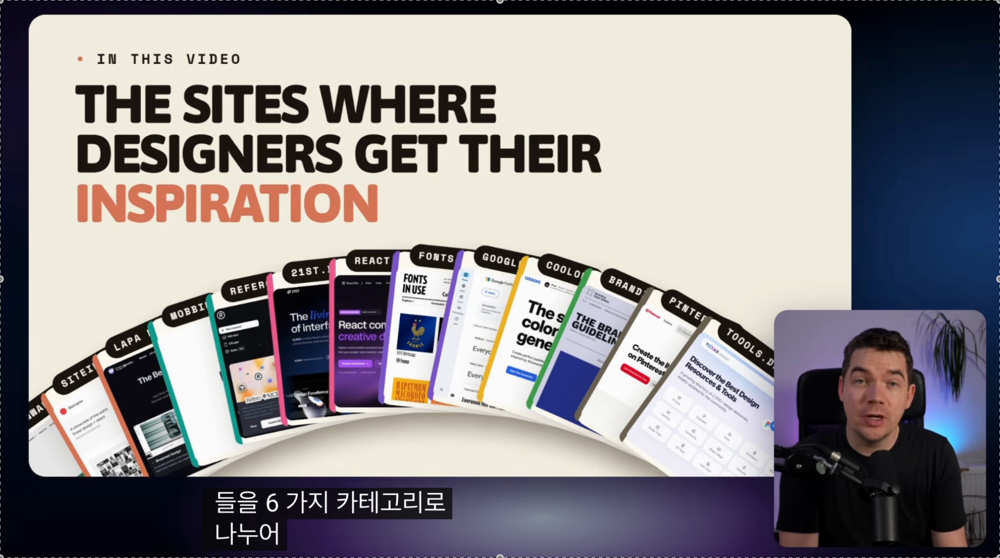

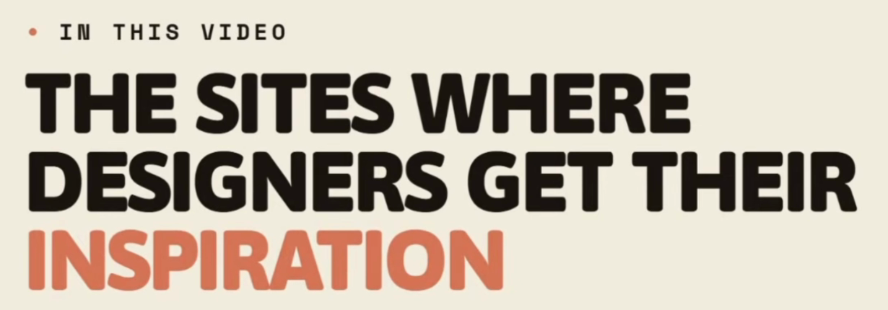

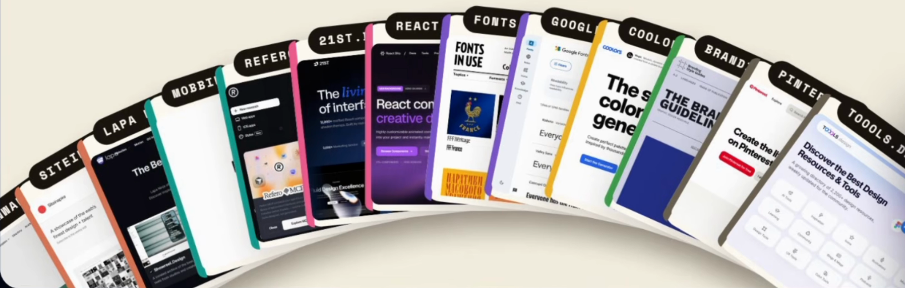

사이트별 카드는 다음과 같습니다.

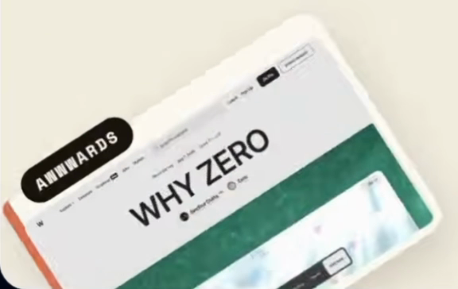
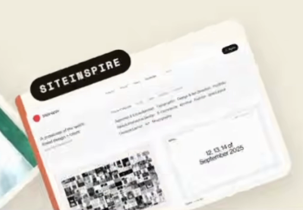

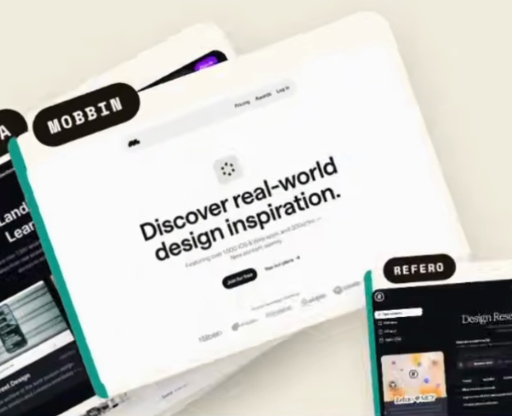
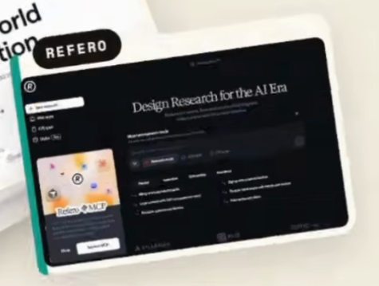
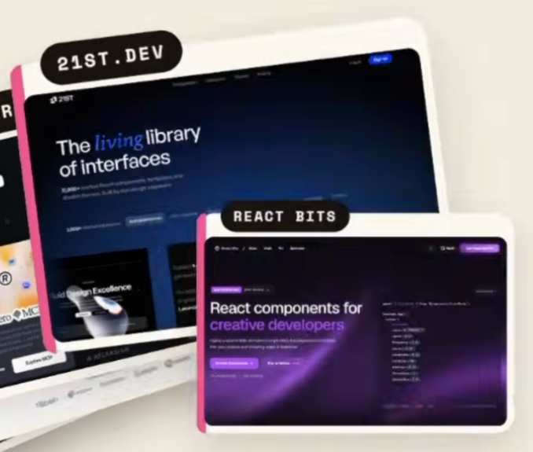
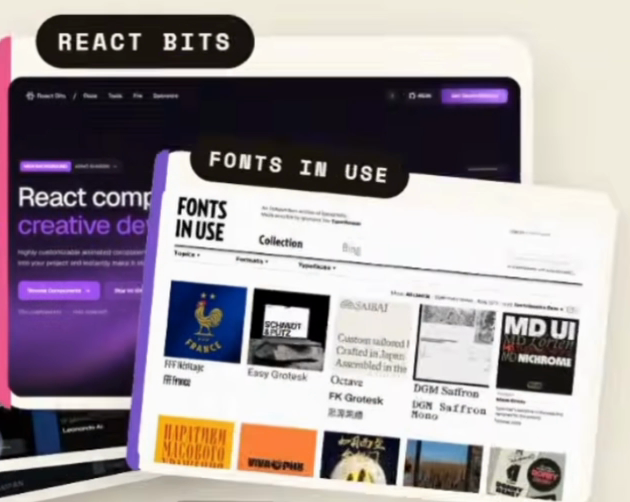
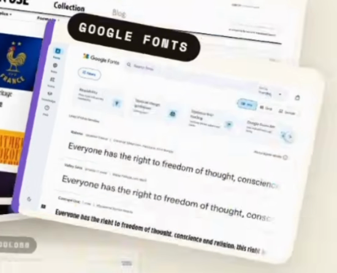
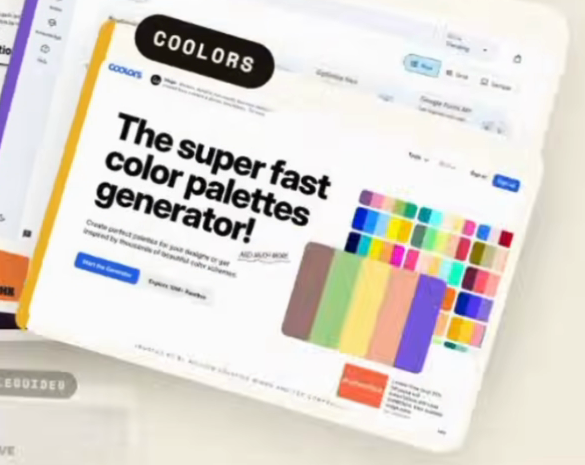
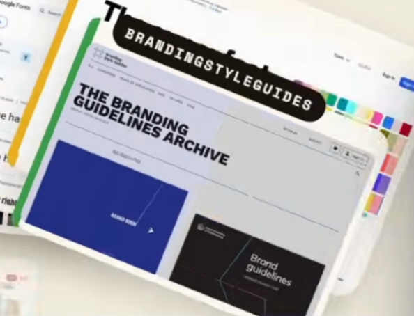
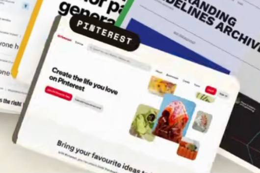
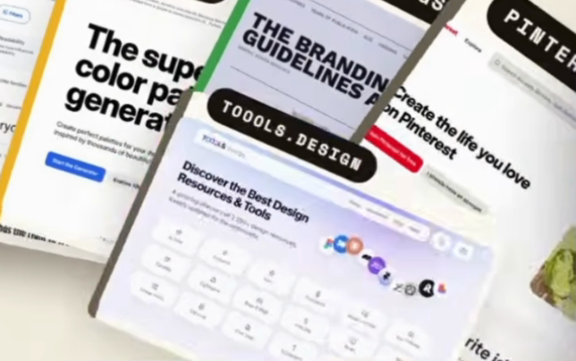

### 10. 6개 카테고리와 정확히 원하는 모습 (클립 30.47~35.00초, YouTube 0:38.1~0:42.6)

> 6가지 카테고리로 나누어 소개할 예정이며, 이를 통해 Claude에게 여러분이 원하는 디자인을 정확히 지시할 수 있을 것입니다.

사이트 카드 부채꼴이 작아지며 사라지고, 번호가 붙은 카테고리 타일 6개가 왼쪽부터 차례로 나타납니다. 32.6초에는 사파리 모자를 쓰고 카메라를 멘 탐험가 캐릭터가 아래에서 올라옵니다. 캐릭터는 레이저 포인터로 03 COMPONENTS 타일을 가리키고, 포인터 옆에 라벨이 나타납니다.

| 화면 원문 | 번역 | 참고 |
| --- | --- | --- |
| BROKEN INTO 6 CATEGORIES | 6개 카테고리로 나누어 | 6만 주황색 큰 숫자입니다. |
| 01 GALLERIES | 01 갤러리 | 주황 타일, 액자 아이콘 |
| 02 REAL APPS | 02 실제 앱 | 청록 타일, 스마트폰 아이콘 |
| 03 COMPONENTS | 03 컴포넌트 | 분홍 타일, UI 부품과 커서 아이콘 |
| 04 FONTS | 04 폰트 | 보라 타일, Aa 아이콘 |
| 05 COLOR | 05 색상 | 노랑 타일, 색상 견본 아이콘 |
| 06 SYSTEMS | 06 시스템 | 초록 타일, 바인더 아이콘 |
| EXACTLY THE LOOK | 정확히 원하는 모습 | 탐험가 캐릭터의 포인터 옆에 나타납니다. |

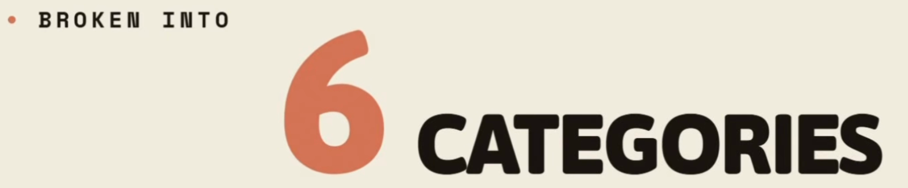

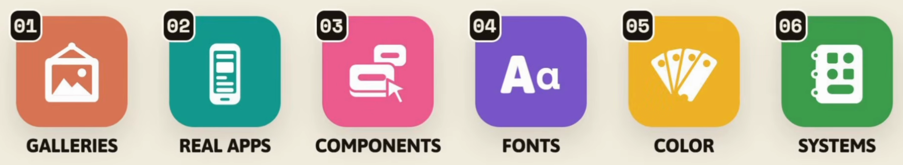

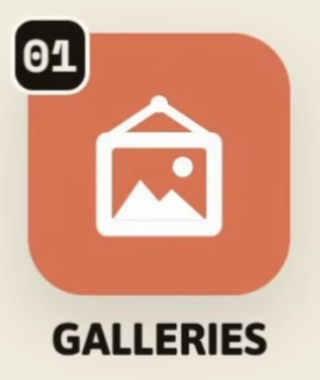
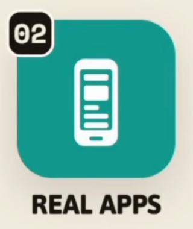
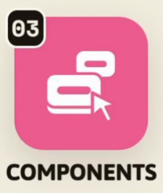
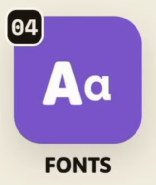
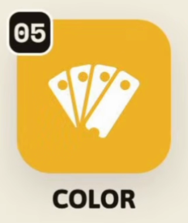
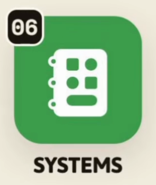

6개 카테고리의 순서는 원본 영상의 챕터 1~6의 순서와 같습니다. 챕터 이름과 시작 시각은 영상 설명에 적힌 그대로 옮겼습니다.

| 타일 | YouTube 챕터 | 시작 시각 |
| --- | --- | --- |
| 01 GALLERIES | 1. Design galleries | 3:05 |
| 02 REAL APPS | 2. Real world apps | 7:48 |
| 03 COMPONENTS | 3. Components | 10:38 |
| 04 FONTS | 4. Fonts | 12:06 |
| 05 COLOR | 5. Colour | 13:17 |
| 06 SYSTEMS | 6. Design Systems | 14:03 |

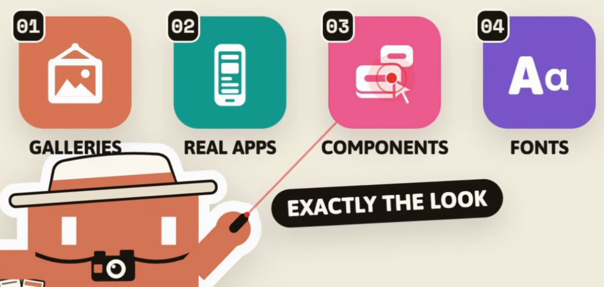

### 11. 실제 적용 사례 (클립 35.00~35.45초, YouTube 0:42.6~0:43.1)

> 이…

웹사이트 목업 세 개가 겹쳐 놓인 화면으로 전환됩니다. 왼쪽은 커피 로스터리 HARBOUR LANE, 가운데는 맥주 양조장 SOUTHSIDE BREWING, 오른쪽은 숲속 호숫가의 오두막 숙소 BLACKWATER CABINS입니다. 화면이 축소되고 왼쪽 위에 IN ACTION 라벨이 나타나는 도중에 클립이 끝납니다.

클립 끝에서 `이…`로 시작한 문장은 YouTube 0:49.4쯤까지 이어집니다. 이 문장에서 발표자는 세 사이트가 이 영상을 위해 직접 만든 랜딩 페이지이며, 모두 Fable 5.1로 만들었다고 설명합니다. 영상 설명은 세 사이트를 3D로 만든 양조장 사이트, 커피 로스터리 사이트, 오두막 숙소 사이트라고 소개합니다. 스토리보드의 0:49 프레임에는 SOUTHSIDE BREWING 사이트가 화면 전체에 나옵니다. 따라서 장면 4의 손글씨 주석에 적힌 맥주 사이트는 SOUTHSIDE BREWING으로 보입니다.

| 화면 원문 | 번역 | 참고 |
| --- | --- | --- |
| IN ACTION | 실제 적용 사례 | 35.08초부터 나타납니다. |
| HARBOUR LANE | HARBOUR LANE | 왼쪽 사이트의 이름표입니다. |
| Roasted by the Atlantic. | 대서양 연안에서 로스팅했습니다. | HARBOUR LANE 사이트의 제목입니다. |
| SOUTHSIDE BREWING | SOUTHSIDE BREWING | 가운데 사이트의 이름표입니다. |
| THE BREW / THE RANGE / STOCKISTS | 맥주 소개 / 제품군 / 판매처 | SOUTHSIDE BREWING 사이트의 메뉴입니다. |
| SOUTHSIDE BREWING · DUBLIN 8 | SOUTHSIDE BREWING, 더블린 8 | 글자가 작아서 마지막 숫자는 확실하지 않습니다. |
| BIG HOPS. SHORT WALK. | 풍성한 홉, 가까운 거리. | SOUTHSIDE BREWING 사이트의 제목입니다. |
| Southside IPA. A hazy 6.2% IPA brewed on Tannery Lane and poured within a few miles of the tank. On tap in your local, in cans at the shop on the corner. | Southside IPA. Tannery Lane에서 양조해 탱크로부터 몇 마일 이내의 거리에서 따라 내는 도수 6.2%의 헤이지 IPA입니다. 동네 펍에서는 생맥주로, 길모퉁이 가게에서는 캔으로 만날 수 있습니다. | 제목 아래 본문입니다. |
| FIND IT NEAR YOU → | 가까운 판매처 찾기 → | 버튼입니다. |
| BLACKWATER CABINS | BLACKWATER CABINS | 오른쪽 사이트의 이름표입니다. 화면이 축소되면 웹캠에 가려 `BLACKWATER CAB`까지만 보입니다. |
| …re Adventure / …ts Tranquility. | …모험 / …평온. | 앞부분이 가운데 카드에 가려 보이지 않습니다. |

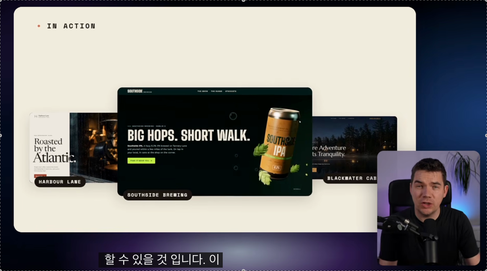

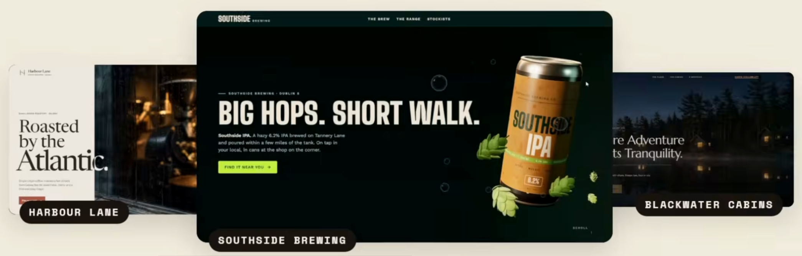

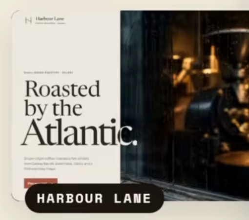

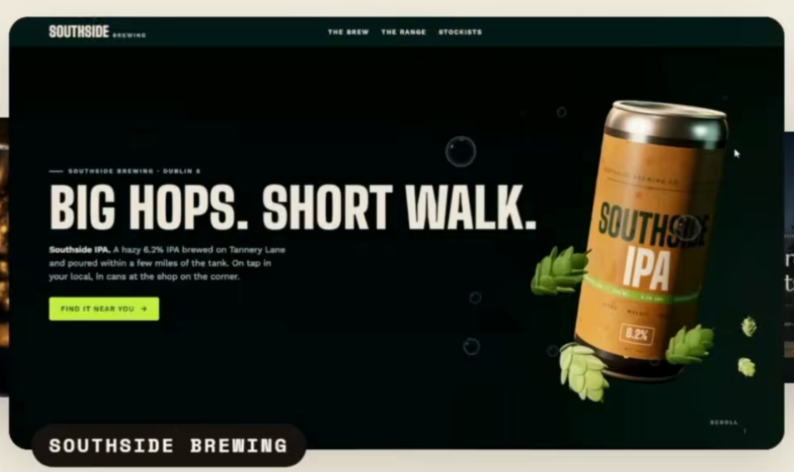

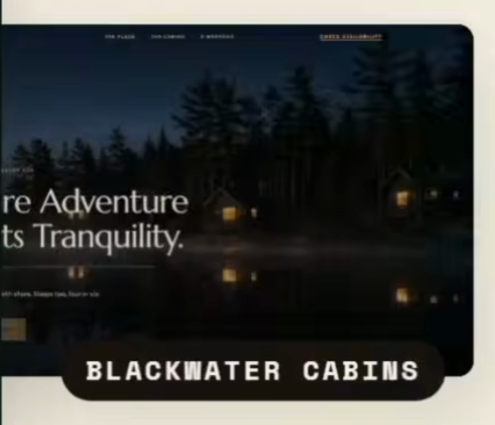

## 에셋 목록

장면별 캡처 미리보기(`contact-sheet.jpg`)를 제외한 모든 이미지는 원본 영상에서 디코딩한 프레임을 그대로 쓰거나 직사각형으로 잘라 낸 것입니다. 미리보기만 프레임을 축소하고 라벨을 붙였습니다. 보정, 회전, 확대, 배경 제거는 하지 않았습니다. 프레임 시각과 자르기 좌표, 파일 크기, SHA-256 해시는 [manifest.json](assets/guide1-mov/manifest.json)에 기록했습니다.

### 캡처

`captures/`에는 2190 × 1224 크기의 전체 프레임이 있습니다. 녹화 화면에 원래 있던 자막과 발표자 웹캠도 그대로 포함됩니다.

| 시각 | 내용 | 파일 |
| --- | --- | --- |
| 0.90초 | 학습량 카운터가 올라가는 장면 | [01-trained-on-counter.png](assets/guide1-mov/captures/01-trained-on-counter.png) |
| 3.00초 | 수백만 개의 웹사이트로 학습 | [02-millions-of-websites.png](assets/guide1-mov/captures/02-millions-of-websites.png) |
| 4.85초 | 현대적인 느낌의 웹사이트를 요청하는 프롬프트 | [03-you-ask-for.png](assets/guide1-mov/captures/03-you-ask-for.png) |
| 5.40초 | 프레스가 웹사이트를 짓누르는 장면 | [04-press-crushing.png](assets/guide1-mov/captures/04-press-crushing.png) |
| 7.00초 | 모든 것의 평균 | [05-average-of-everything.png](assets/guide1-mov/captures/05-average-of-everything.png) |
| 10.20초 | 가장 중요한 것: 슬레이트와 ORYZO 레퍼런스 | [06-most-important-thing.png](assets/guide1-mov/captures/06-most-important-thing.png) |
| 12.45초 | 캐릭터가 ORYZO 레퍼런스를 들어 보이는 장면 | [07-character-with-reference.png](assets/guide1-mov/captures/07-character-with-reference.png) |
| 13.30초 | 반복 루프 다이어그램의 시작 상태 | [08-loop-setup.png](assets/guide1-mov/captures/08-loop-setup.png) |
| 14.50초 | 반복이 진행 중인 루프 다이어그램 | [09-loop-iterating.png](assets/guide1-mov/captures/09-loop-iterating.png) |
| 16.40초 | 품질 기준선을 통과한 v4 | [10-loop-cleared.png](assets/guide1-mov/captures/10-loop-cleared.png) |
| 17.75초 | 독심술사가 아닙니다 | [11-not-a-mind-reader.png](assets/guide1-mov/captures/11-not-a-mind-reader.png) |
| 20.60초 | 스타일 형용사 칩이 쌓이기 시작하는 장면 | [12-style-first-chips.png](assets/guide1-mov/captures/12-style-first-chips.png) |
| 21.55초 | 형용사 칩 14개와 MEH에 머문 게이지 | [13-style-all-chips.png](assets/guide1-mov/captures/13-style-all-chips.png) |
| 21.92초 | 형용사 카드를 구겨 버리는 장면 | [14-chips-crumpled.png](assets/guide1-mov/captures/14-chips-crumpled.png) |
| 23.70초 | FLOEMA 예시와 MUCH BETTER로 바뀐 게이지 | [15-example-floema.png](assets/guide1-mov/captures/15-example-floema.png) |
| 25.15초 | SON DAVEN 예시가 겹쳐진 장면 | [16-example-son-daven.png](assets/guide1-mov/captures/16-example-son-daven.png) |
| 25.80초 | 세 예시 사이트가 쌓인 장면 | [17-example-studio.png](assets/guide1-mov/captures/17-example-studio.png) |
| 30.00초 | 디자이너들이 영감을 얻는 사이트 | [18-inspiration-sites.png](assets/guide1-mov/captures/18-inspiration-sites.png) |
| 32.30초 | 6개 카테고리 | [19-six-categories.png](assets/guide1-mov/captures/19-six-categories.png) |
| 34.00초 | 정확히 원하는 모습 | [20-exactly-the-look.png](assets/guide1-mov/captures/20-exactly-the-look.png) |
| 35.42초 | 실제 적용 사례 | [21-in-action.png](assets/guide1-mov/captures/21-in-action.png) |

### 크롭

`crops/`에는 장면의 주요 요소를 원본 픽셀 크기 그대로 잘라 낸 이미지가 있습니다. 원본에서 다른 요소에 가려진 부분은 복원하지 않았습니다.

| 시각 | 내용 | 크기 | 파일 |
| --- | --- | --- | --- |
| 3.00초 | TRAINED ON MILLIONS OF WEBSITES 카드와 모델 배지 | 1245 × 545 | [01-millions-of-websites-card.png](assets/guide1-mov/crops/01-millions-of-websites-card.png) |
| 4.85초 | YOU ASK FOR 프롬프트 카드 | 1460 × 465 | [02-you-ask-for-prompt.png](assets/guide1-mov/crops/02-you-ask-for-prompt.png) |
| 5.40초 | 웹사이트를 짓누르는 프레스 | 2120 × 753 | [03-press-crushing.png](assets/guide1-mov/crops/03-press-crushing.png) |
| 6.60초 | 흐릿한 평균적인 웹사이트 목업 | 952 × 588 | [04-average-website-mockup.png](assets/guide1-mov/crops/04-average-website-mockup.png) |
| 7.00초 | THE AVERAGE OF EVERYTHING 제목 | 1300 × 375 | [05-average-of-everything-headline.png](assets/guide1-mov/crops/05-average-of-everything-headline.png) |
| 7.80초 | ORYZO 레퍼런스 카드의 첫 화면 | 645 × 462 | [06-oryzo-hero.png](assets/guide1-mov/crops/06-oryzo-hero.png) |
| 10.20초 | SO WHAT DO YOU DO? THE MOST IMPORTANT THING 제목 | 1030 × 310 | [07-most-important-thing-headline.png](assets/guide1-mov/crops/07-most-important-thing-headline.png) |
| 10.20초 | REFERENCE 01 ORYZO 카드 | 625 × 455 | [08-oryzo-reference-card.png](assets/guide1-mov/crops/08-oryzo-reference-card.png) |
| 10.30초 | 작품, 감독, 출연이 적힌 영화 슬레이트 | 635 × 460 | [09-film-slate.png](assets/guide1-mov/crops/09-film-slate.png) |
| 12.45초 | ORYZO 레퍼런스를 들어 보이는 캐릭터 | 1062 × 654 | [10-character-holding-reference.png](assets/guide1-mov/crops/10-character-holding-reference.png) |
| 12.45초 | 맥주 사이트의 실제 레퍼런스라는 손글씨 주석 | 628 × 125 | [11-beer-site-annotation.png](assets/guide1-mov/crops/11-beer-site-annotation.png) |
| 13.30초 | 반복 루프 다이어그램 시작 상태 | 1380 × 820 | [12-loop-diagram-setup.png](assets/guide1-mov/crops/12-loop-diagram-setup.png) |
| 14.50초 | 반복 루프 다이어그램 2회 반복 | 1380 × 820 | [13-loop-diagram-iterating.png](assets/guide1-mov/crops/13-loop-diagram-iterating.png) |
| 16.40초 | 반복 루프 다이어그램 4회 반복 후 통과 | 1380 × 820 | [14-loop-diagram-cleared.png](assets/guide1-mov/crops/14-loop-diagram-cleared.png) |
| 17.75초 | 수정 구슬을 든 캐릭터와 NOT A MIND READER | 2105 × 820 | [15-not-a-mind-reader.png](assets/guide1-mov/crops/15-not-a-mind-reader.png) |
| 17.75초 | NOT A MIND READER 제목 | 955 × 615 | [16-not-a-mind-reader-headline.png](assets/guide1-mov/crops/16-not-a-mind-reader-headline.png) |
| 20.60초 | WHAT STYLE DO YOU WANT? 라벨 | 790 × 75 | [17-what-style-label.png](assets/guide1-mov/crops/17-what-style-label.png) |
| 21.55초 | make it look… 형용사 칩 14개 | 875 × 740 | [18-style-adjective-chips.png](assets/guide1-mov/crops/18-style-adjective-chips.png) |
| 21.55초 | RESULTS 게이지: MEH | 600 × 485 | [19-results-gauge-meh.png](assets/guide1-mov/crops/19-results-gauge-meh.png) |
| 21.92초 | 구겨진 종이 뭉치 | 290 × 283 | [20-crumpled-paper-ball.png](assets/guide1-mov/crops/20-crumpled-paper-ball.png) |
| 23.70초 | EXAMPLE 01 FLOEMA 카드 | 886 × 578 | [21-example-01-floema.png](assets/guide1-mov/crops/21-example-01-floema.png) |
| 23.70초 | RESULTS 게이지: MUCH BETTER | 600 × 485 | [22-results-gauge-much-better.png](assets/guide1-mov/crops/22-results-gauge-much-better.png) |
| 25.15초 | EXAMPLE 02 SON DAVEN 카드 | 770 × 560 | [23-example-02-son-daven.png](assets/guide1-mov/crops/23-example-02-son-daven.png) |
| 25.80초 | EXAMPLE 03 STUDIO 카드 | 696 × 490 | [24-example-03-studio.png](assets/guide1-mov/crops/24-example-03-studio.png) |
| 25.80초 | 세 예시 사이트 카드 묶음 | 1058 × 740 | [25-example-cards-stack.png](assets/guide1-mov/crops/25-example-cards-stack.png) |
| 26.13초 | AWWWARDS 카드 | 576 × 364 | [26-site-awwwards.png](assets/guide1-mov/crops/26-site-awwwards.png) |
| 26.22초 | SITEINSPIRE 카드 | 510 × 354 | [27-site-siteinspire.png](assets/guide1-mov/crops/27-site-siteinspire.png) |
| 26.33초 | LAPA NINJA 카드 | 580 × 444 | [28-site-lapa-ninja.png](assets/guide1-mov/crops/28-site-lapa-ninja.png) |
| 26.47초 | MOBBIN 카드 | 650 × 529 | [29-site-mobbin.png](assets/guide1-mov/crops/29-site-mobbin.png) |
| 26.50초 | REFERO 카드 | 475 × 359 | [30-site-refero.png](assets/guide1-mov/crops/30-site-refero.png) |
| 26.73초 | 21ST.DEV와 REACT BITS 카드 | 678 × 575 | [31-site-21st-dev-react-bits.png](assets/guide1-mov/crops/31-site-21st-dev-react-bits.png) |
| 26.83초 | FONTS IN USE 카드 | 630 × 502 | [32-site-fonts-in-use.png](assets/guide1-mov/crops/32-site-fonts-in-use.png) |
| 26.93초 | GOOGLE FONTS 카드 | 550 × 445 | [33-site-google-fonts.png](assets/guide1-mov/crops/33-site-google-fonts.png) |
| 27.06초 | COOLORS 카드 | 585 × 465 | [34-site-coolors.png](assets/guide1-mov/crops/34-site-coolors.png) |
| 27.13초 | BRANDINGSTYLEGUIDES 카드 | 594 × 454 | [35-site-brandingstyleguides.png](assets/guide1-mov/crops/35-site-brandingstyleguides.png) |
| 27.22초 | PINTEREST 카드 | 530 × 354 | [36-site-pinterest.png](assets/guide1-mov/crops/36-site-pinterest.png) |
| 27.29초 | TOOOLS.DESIGN 카드 | 644 × 404 | [37-site-tooools-design.png](assets/guide1-mov/crops/37-site-tooools-design.png) |
| 30.00초 | IN THIS VIDEO 제목 | 1230 × 430 | [38-in-this-video-headline.png](assets/guide1-mov/crops/38-in-this-video-headline.png) |
| 30.00초 | 영감 사이트 13곳의 카드 부채꼴 | 1631 × 519 | [39-inspiration-sites-fan.png](assets/guide1-mov/crops/39-inspiration-sites-fan.png) |
| 32.30초 | BROKEN INTO 6 CATEGORIES 제목 | 1565 × 325 | [40-six-categories-headline.png](assets/guide1-mov/crops/40-six-categories-headline.png) |
| 32.30초 | 6개 카테고리 타일 | 2125 × 390 | [41-six-category-tiles.png](assets/guide1-mov/crops/41-six-category-tiles.png) |
| 32.30초 | 01 GALLERIES 타일 | 320 × 380 | [42-category-galleries.png](assets/guide1-mov/crops/42-category-galleries.png) |
| 32.30초 | 02 REAL APPS 타일 | 320 × 380 | [43-category-real-apps.png](assets/guide1-mov/crops/43-category-real-apps.png) |
| 32.30초 | 03 COMPONENTS 타일 | 320 × 380 | [44-category-components.png](assets/guide1-mov/crops/44-category-components.png) |
| 32.30초 | 04 FONTS 타일 | 320 × 380 | [45-category-fonts.png](assets/guide1-mov/crops/45-category-fonts.png) |
| 32.30초 | 05 COLOR 타일 | 320 × 380 | [46-category-color.png](assets/guide1-mov/crops/46-category-color.png) |
| 32.30초 | 06 SYSTEMS 타일 | 320 × 380 | [47-category-systems.png](assets/guide1-mov/crops/47-category-systems.png) |
| 34.00초 | 탐험가 캐릭터와 EXACTLY THE LOOK 라벨 | 1406 × 670 | [48-explorer-exactly-the-look.png](assets/guide1-mov/crops/48-explorer-exactly-the-look.png) |
| 35.00초 | 실제 적용 사례 사이트 3개 | 2090 × 670 | [49-in-action-sites.png](assets/guide1-mov/crops/49-in-action-sites.png) |
| 35.00초 | HARBOUR LANE 사이트 | 510 × 452 | [50-harbour-lane.png](assets/guide1-mov/crops/50-harbour-lane.png) |
| 35.00초 | SOUTHSIDE BREWING 사이트 | 1110 × 661 | [51-southside-brewing.png](assets/guide1-mov/crops/51-southside-brewing.png) |
| 35.00초 | BLACKWATER CABINS 사이트 | 495 × 425 | [52-blackwater-cabins.png](assets/guide1-mov/crops/52-blackwater-cabins.png) |

### 다시 추출하는 방법

ffmpeg, ffprobe, Pillow가 설치된 환경에서 다음 명령을 실행하면 같은 이미지가 다시 만들어집니다.

```sh
python3 scripts/extract_mov_note_assets.py
```
