## 기법 1: 시드 문자열로 다양성 불어넣기

*Technique 1: Use seed strings to inject variety*

- 목표: 모델이 학습에서 익힌 기본 디자인 대신 바깥의 새로운 영감에서 출발하게 한다.
- 같은 기본 프롬프트(`Build me a landing page for my productivity app.`)를 Claude Code 네 개에 주면, Claude Opus 5는 거의 매번 보랏빛 그라데이션에 왼쪽 텍스트와 오른쪽 그래픽이라는 같은 구조를 낸다(그림 5).

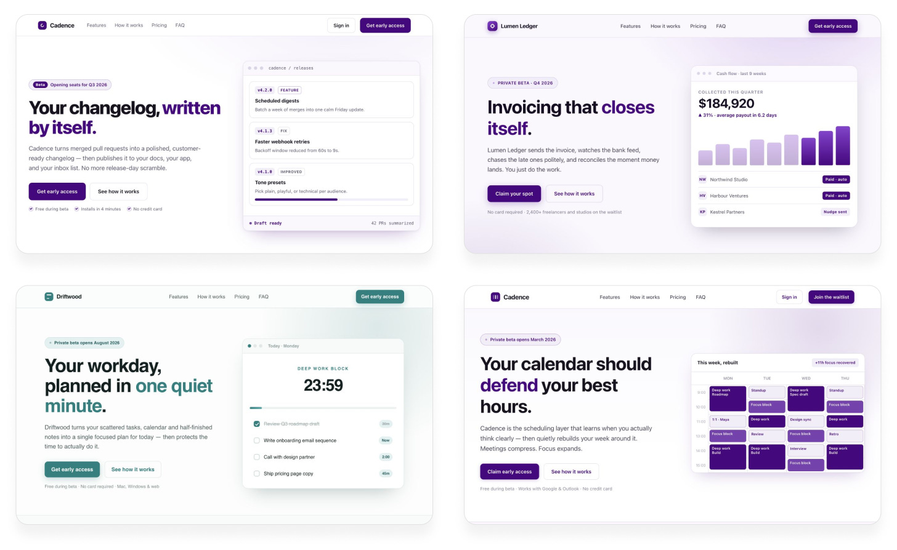

- "완전히 독특하게, 모든 결정을 무작위로" 해 달라고 덧붙여도 결과끼리 닮았다. 색 조합과 구조, 어색한 도자기 비유까지 반복된다(그림 6). 모델이 진짜 무작위가 아니라 무작위처럼 들리는 토큰을 예측하기 때문이다.

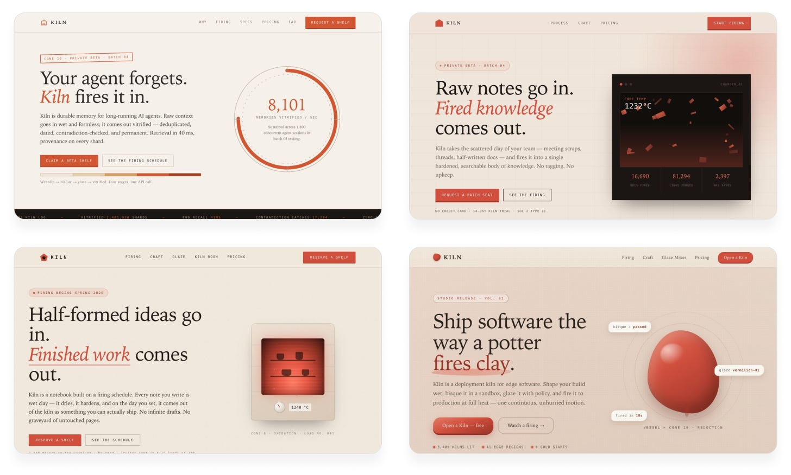

- 핵심: 모델은 스스로 무작위일 수 없으니 다양성은 모델 밖에서 가져와야 한다. 그 방법이 Sakana AI가 발표한 [String Seed of Thought](https://pub.sakana.ai/ssot/)로, AI가 만든 무작위 문자열을 디자인 영감으로 쓰게 한다.
- 프롬프트 요지:
  1. 셸 스크립트로 긴 무작위 영숫자 문자열을 만든다.
  2. 문자열 속 하위 패턴이나 특별한 숫자까지 살펴 색 조합, 레이아웃, 타이포그래피 방향을 정한다.
  3. 스스로 판단해 그 방향을 완성도 있게 구현하되, 문자열은 디자인에 드러내지 않는다.
- 결과(그림 7): 색 조합, 글꼴, 아이디어가 확연히 다양해졌다. 누구나 얻는 기본 결과와 달리 실행할 때마다 다른 결과가 나온다.

## 기법 2: 프롬프트를 훨씬 더 야심 차게 쓰기

*Technique 2: Be much more ambitious with your prompts*

- 구체적이고 대담한 프롬프트는 모델에게 즉흥적으로 고르는 대신 따를 비전을 준다.
- 독창적인 아이디어의 원천은 자기 취향이다. 비디오 게임, 인테리어 트렌드, 설치 미술 같은 영감을 정하고, 그것이 결과물에 어떻게 스며들지 설명한다.
- 예시 1: 대담한 픽셀 아트 테마로, 각 섹션이 게임 속 한 장면 같으면서도 랜딩 페이지로 작동하게 한다(그림 8).

- 예시 2: 기능을 동네나 건물로 표현한 아이소메트릭 3D 도시를 배경으로 삼는다(그림 9).

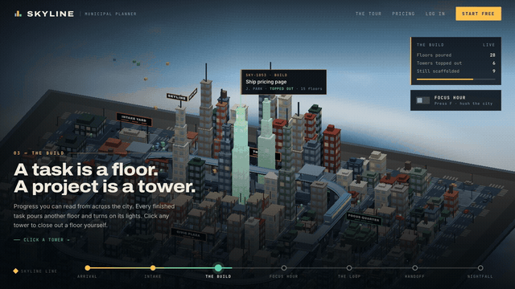

- 예시 3: 극단적인 비대칭, 불협화음 같은 색과 타이포그래피, 불편한 여백으로 규칙을 다 깨되 보기 좋게 만든다(그림 10).

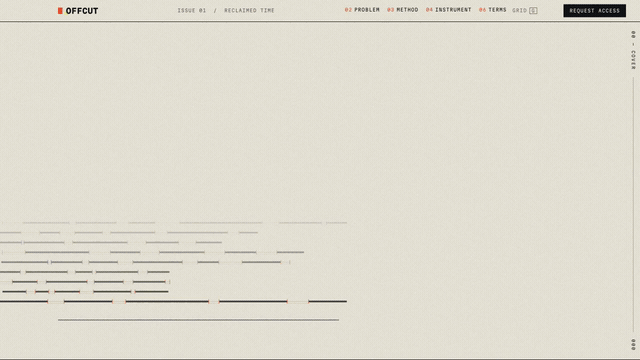

- 어려운 건 요청할 아이디어 자체를 떠올리는 일이다. AI에게 그냥 물으면 모두가 받는 평균적인 아이디어가 나오므로, 저자는 아래 세 단계를 쓴다.

#### 1. 세부 없이 아이디어를 잔뜩 나열하게 하기

*1. Ask AI to list a bunch of ideas, intentionally lacking detail. The goal is just to inspire your imagination.*

- 대담하고 독특한 디자인 언어 아이디어를 짧은 설명과 함께, 깊이보다 폭 위주로 최대한 많이 달라고 한다.
- AI 답변(그림 11): Brutalist Utility, Industrial Control Panel, Gel Interface, Cardboard Prototype, Comic Book UI 등.

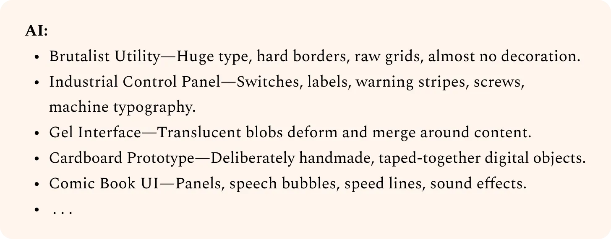

#### 2. 마음에 드는 방향을 시각화하고 반응을 적은 뒤 다듬게 하기

*2. Visualize your favorites and note how you react to different directions. Then ask AI to refine them.*

- 'Industrial Control Panel'에 대해 원하는 것(딸깍거리는 버튼과 소리 같은 촉감, 일관된 컴포넌트와 절제된 디테일, 질감과 약간의 색)과 피할 것(만화풍, 스큐어모픽, 밋밋한 회색 그라데이션)을 적어 취향에 맞게 다듬어 달라고 한다.
- AI 답변(그림 12): 고급 전문 장비에서 영감을 받은 촉각적이고 정교한 인터페이스로 좁히고, 재질은 분체 도장이나 양극 산화 같은 은은한 표면을 제안한다.

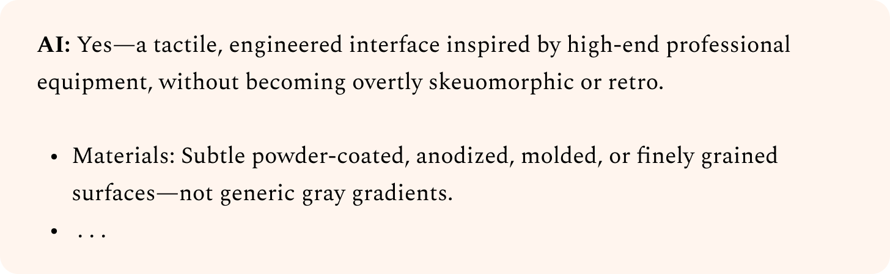

#### 3. 만족할 때까지 반복한 뒤 제작용 프롬프트를 쓰게 하기

*3. Iterate until you’re satisfied, then ask AI to write the prompt to build it.*

- 마지막으로 이 방향으로 POC 페이지를 만들 간결한 프롬프트를 써 달라고 한다.
- AI 답변(그림 13): "Precision Industrial" 제어판 디자인 언어를 보여 주는 단일 페이지 POC 제작 프롬프트다. 레트로, 만화풍, 과한 스큐어모픽은 피하라고 못 박는다.

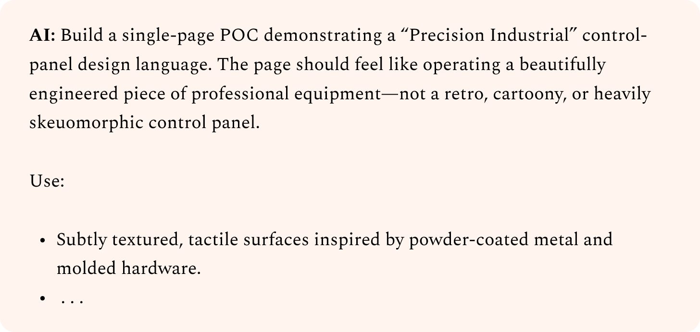

- AI가 낸 아이디어를 그대로 되먹이면 누구나 만들 수 있는 결과가 나온다. 방향을 직접 조종해야 나만의 결과가 나온다.
- 형편없어 보이는 아이디어도 시도한다. "이게 될 리 없어" 싶다면 제대로 가고 있는 것이다. 안 된 프롬프트는 저장해 두고 새 모델이 나오면 다시 돌려 본다.

# 정의: 디자인 방향 심화하기

*Define: Deepen your design direction*

- 넓게 탐색해 유망한 시안을 골라도, AI의 첫 디자인은 대개 여전히 평범하다.
- 시드 문자열로 만든 시안(그림 14)도 왼쪽 텍스트와 CTA 버튼, 상단 내비게이션, 오른쪽 그래픽이라는 낡은 패턴에 기댄다.

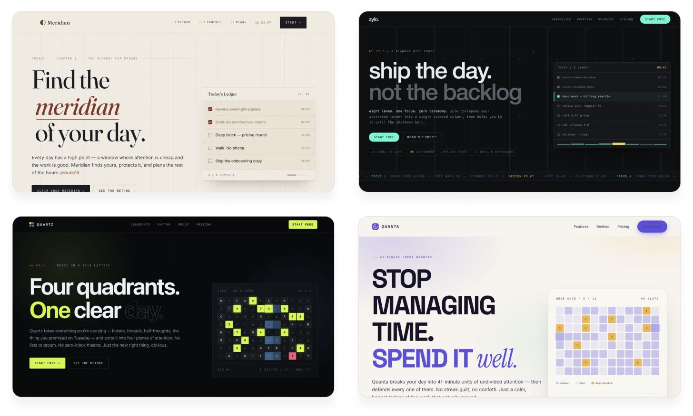

- 이 단계의 목표는 뚜렷한 디자인 선택으로 시안마다 고유한 개성을 주는 것이다.

## 기법 3: 서브에이전트로 긍정적 피드백 루프 만들기

*Technique 3: Create positive feedback loops with subagents*

- 에이전트에게 자기 디자인을 고치라고 하면 객관적이지 않다. 자기 코드와 과거 결정, 근거를 다시 보느라 한발 물러나 큰 그림을 보지 못한다.
- 그래서 '디자인 비평가(design critic)' 역할의 별도 에이전트가 완성도를 판단하게 한다. 비평가는 스크린샷만 보고, 구현 방식이나 들인 노력과 무관하게 품질 기준 충족 여부만 본다.
- 비평가는 핵심 판단에만 쓰이므로 크고 비싼 모델을 써도 부담이 적다. 싸고 빠른 모델이 실무를, 강한 모델이 안목을 맡는다.
- 예시: 구현은 Claude Opus 5, 비평가는 Claude Fable 5.
- 프롬프트 요지:
  - 반복마다 스크린샷을 찍어, 코드나 이전 반복과 비평 없이 새 컨텍스트의 비평가에게 넘긴다.
  - 비평가는 디자인이 노리는 미감과 최고 수준 스튜디오의 구현을 떠올려 가장 큰 격차를 짚고, 그 수준에 얼마나 가까운지 10점 만점으로 채점한다.
  - 비평가 지침: 큰 구조와 세부를 함께 보고, 과하거나 AI 티 나는 패턴은 감점하며, 구체적이고 대담하게 판단한다.
  - 비평가가 독립적으로 9/10 이상을 줘야 끝난다. 이 기준은 비평가에게 알리지 않고, 비평가 프롬프트는 매번 같게 쓴다.
- 결과(그림 15): 판에 박은 레이아웃이 원래의 미감은 유지한 채 시안마다 다른 정체성을 갖게 됐다.

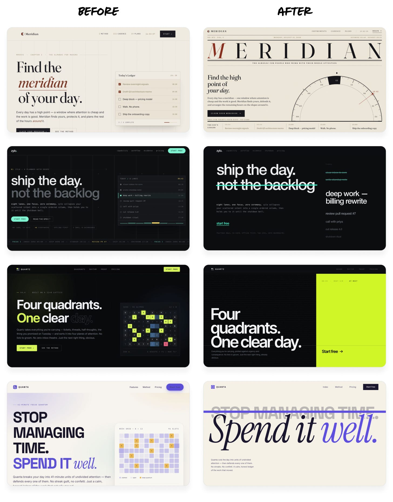

- Fable이 차지한 출력 토큰은 매번 10% 미만이었다. Fable에게 직접 다시 디자인시켰다면 비용은 두 배, 시간은 훨씬 더 들었을 것이다.
- 루프 설정 팁:
  - 비평 기준은 명확하고 객관적으로 정한다. "아름다운가"처럼 주관적인 기준은 실행마다 결과가 흔들린다. 전문가 디자인 4개와 우리 스크린샷 1개를 섞어 완성도 순위를 매기게 하는 식이 가장 좋다.
  - 목표 품질을 보여 주는 예시 이미지를 주되, 베낄 대상이 아니라 기준이나 무드보드로 다루게 한다.
  - 종료 기준을 신중히 정한다. 없으면 비평가가 끝내 만족하지 않아 토큰만 탄다. 한두 번만 돌려 수렴하는지 먼저 본다.
  - 역할별로 모델을 고른다. 비평가는 큰 모델이 안목과 아이디어 폭에서 유리하다. 구현 모델은 작아도 되지만 방향을 제대로 실행할 수준은 돼야 한다.

## 기법 4: 이미지 생성으로 디자인 풍부하게 만들기

*Technique 4: Use image generation to enrich designs*

- 코딩 에이전트는 이미지를 거의 쓰지 않고 그라데이션, 도형, 기본 패턴 같은 쉬운 코드 대안에 기댄다. 모두 AI 디자인의 뚜렷한 신호다.
- 이미지 도구가 내장돼 있어도 잘 안 쓰고, 없어도 OpenAI나 Gemini API 키만 있으면 이미지를 만들 수 있다.
- 프롬프트 요지: 밋밋한 디자인에 생성 이미지로 개성을 더하고, 셰이더나 3D 효과와의 조합도 고려하게 한다. API 키는 로컬에서만 쓰게 하고, 결과는 브라우저에서 프레임 단위로 확인하게 한다.
- 결과(그림 16~19, Claude Opus 5 적용 전후): 짧은 시간에 개성이 크게 늘고, 겉핥기 이상의 공이 보여 AI 티가 줄어든다.

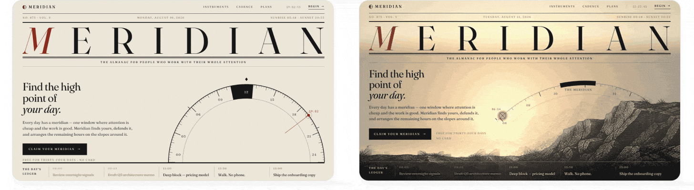

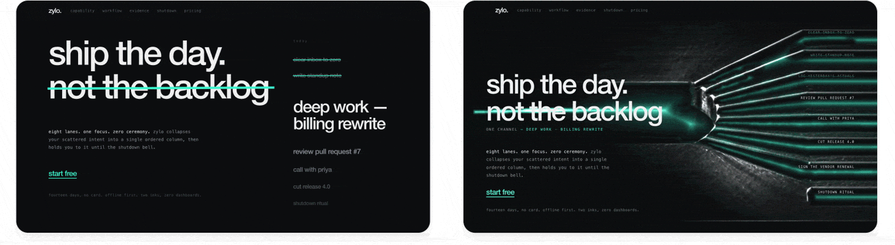

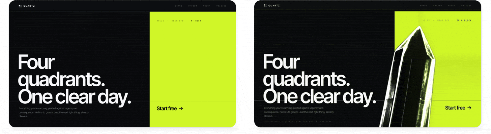

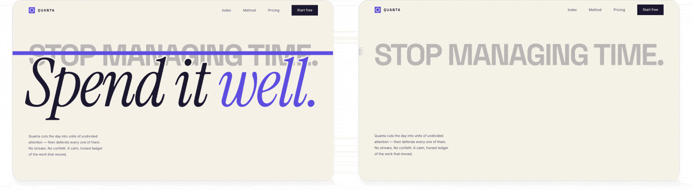

- 환경별 연결 방법:
  - Codex, Antigravity, Grok Build: 내장 이미지 생성을 쓰라고 지시한다. 시키기 전에는 거의 안 쓴다.
  - Claude Code 등을 쓰면서 ChatGPT를 구독하는 경우: Codex CLI로 생성하되 API 키가 아니라 구독으로 과금되게 해 추가 비용을 없앤다.
  - Claude만 쓰거나 기타 도구를 쓰는 경우: OpenAI나 Gemini API 키를 준다. 지출 한도를 낮게 건 에이전트 전용 키를 쓰면 유출이나 오용에도 비용이 통제되고 쉽게 폐기할 수 있다.
  - 키를 자주 붙여 넣는다면 gitignore된 `.env.agents`에 저장하게 하고, 개발용이며 제품에 포함하지 말라는 메모를 AGENTS.md/CLAUDE.md에 남기게 한다.

## 기법 5: 더 정교한 모션에는 영상 생성 활용하기

*Technique 5: For more advanced motion, use video generation*

- 영상 생성 모델은 UGC 광고나 '윌 스미스 스파게티' 같은 영상 말고도 일상 디자인 작업에서 큰 효과를 낸다.
- 모델이 많고 최고 모델이 자주 바뀌므로 [fal.ai](http://fal.ai/) 같은 통합 플랫폼을 쓰면, 키 하나로 에이전트가 여러 모델을 비교해 고를 수 있다.

#### 눈길을 사로잡는 애니메이션 그래픽 만들기

*Create stunning animated graphics*

- 요령: 단색 배경의 루프 클립을 만든 뒤 크로마키로 배경을 빼거나, 복잡하면 영상 매팅 모델로 제거한다. 영상 티 없이 UI 어디에든 겹칠 수 있는 애니메이션이 된다.
- 프롬프트 요지: 페이지의 크리스털 이미지를, 쪼개지며 천천히 회전하고 배경을 굴절시키며 빛과 그림자를 드리우는 루프 영상으로 교체한다. 굴절이 자연스럽도록 페이지 배경색 위에서 먼저 렌더링한 뒤 매팅으로 배경을 지우고, 적합한 최신 모델은 fal.ai에서 찾게 한다.
- 결과(그림 20, GPT-5.6 Sol 적용 전후): 코스틱 반사, 유리 굴절, 복잡한 물리 움직임까지, 코드로는 어려운 풍부한 효과다.

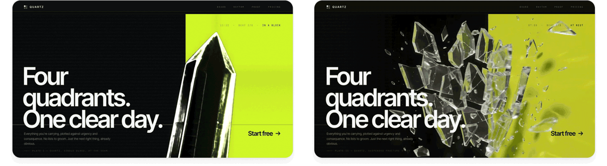

#### 상태 사이의 매끄러운 전환 만들기

*Create fluid transitions between states*

- 저평가된 활용법이다. 많은 영상 모델이 키프레임 이미지 사이를 보간할 수 있어, 제품 정지 이미지 두 장 사이의 전환 클립을 만들고 화면 이동 때 재생하거나 스크롤과 스와이프에 맞춰 프레임 단위로 스크럽할 수 있다.
- 예시: Codex의 GPT-5.6 Sol로 프롬프트 하나만에 만든 여행 가방 데모(그림 21).
- 프롬프트 요지: 공중에 뜬 가방, 바닥에 내려앉아 열리는 가방, 위에서 짐이 가지런히 담기는 가방의 세 상태를 스크롤에 맞는 세로 움직임으로 잇는다. 첫 프레임은 이미지 생성으로 만들고, 각 클립의 마지막 프레임을 다음 전환의 시작으로 써서 이음매 없이 연결한다. Seedance 2.5처럼 물리와 일관성이 강한 모델을 쓴다.

- 스크롤에 따라 전환이 부드럽게 움직여 만지는 재미가 있고, 사용자가 계속 스크롤하며 더 읽게 만든다.

# 전달: 사용자가 좋아할 디자인으로 다듬기

*Deliver: Polish your design into something users will love*

- 독특한 디자인에 도달했다면 마지막은 디테일을 정리해 실서비스에 쓸 수 있게 만드는 일이다. 디자인이 말이 되는지, 흐름이 자연스러운지, 실제로 쓸모 있는지는 사람의 판단에 달렸다.

## 기법 6: 가치를 더하지 않는 요소 덜어내기

*Technique 6: Cut out elements that don’t add value*

- AI는 더하기만 하고 빼기는 거의 하지 않는다. 과잉 설명과 쓸모없는 요소가 AI 디자인의 가장 큰 신호이고, 절제된 디자인은 바로 고급스러워 보인다.
- 저자의 다듬기 작업은 대부분 빼는 일이다. '깔끔하고 미니멀하게'를 요청했는데도 칼로리 추적 앱의 Claude 초기 디자인(그림 22)에는 군더더기가 많았다.
  - 배경과 진행 바의 분홍빛 글로우
  - 이유 없는 텍스트 색과 하이라이트
  - 이미지로 충분한데 붙은 라벨과 빈 공간
  - iOS 기본 컴포넌트보다 못한 커스텀 버튼과 입력 필드

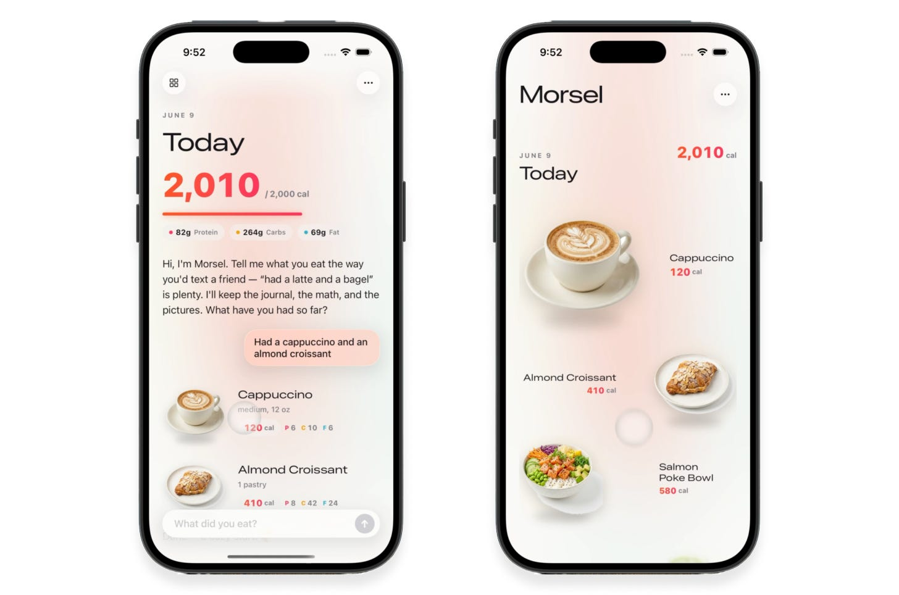

- 이미지 중심 그리드, 그라데이션과 글로우와 불필요한 컨테이너 제거, Apple 네이티브 같은 미니멀함을 요청한 결과(그림 23): 비주얼이 스스로 말하고, 네이티브 iOS 컴포넌트에 과한 색과 그라데이션이 사라졌으며, 텍스트는 작고 간결해졌다.

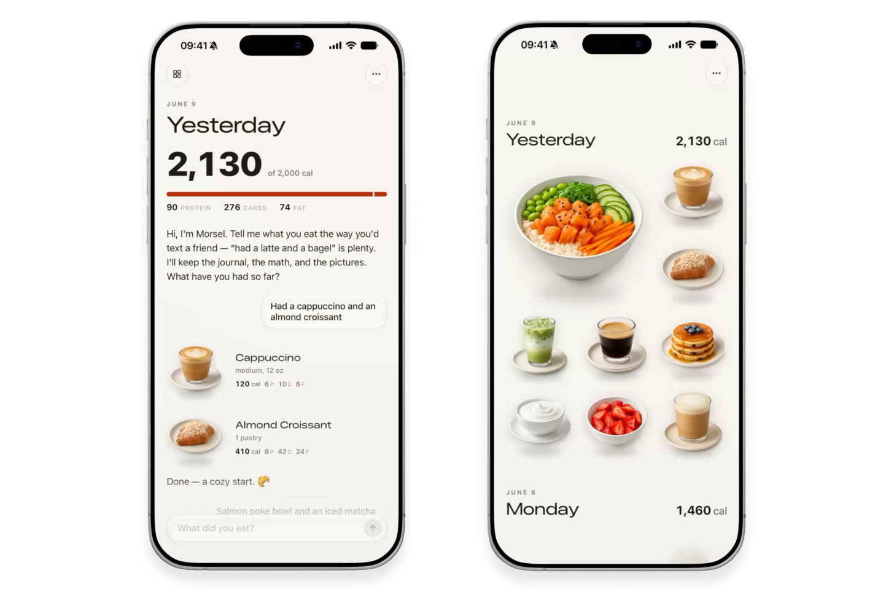

- AI는 디자인을 걷어 내고 코드를 지우는 걸 위험하게 여겨 스스로 하지 않으니, 사람이 밀어 줘야 한다. 정말 필요한 것만 남기면 사용자를 압도하지 않고 주의를 붙잡아 더 많이 전달한다.

## 기법 7: AI 티 없애기

*Technique 7: Remove AI tells*

- 모델마다 남용하는 패턴이 있다. 그 자체로 나쁘진 않지만 모든 디자인에서 보이면 AI 슬롭의 신호가 된다.
- 패턴과 대안을 알아 두면 디자인이 더 정돈되고 고급스러워진다. 일괄 금지가 아니라 의도적으로 쓰는 것이 핵심이다.
- 흔한 AI 디자인 티와 대안(그림 24 요약):

| 과용 패턴 | 대안 |
| --- | --- |
| 뻔한 내용을 반복하는 작은 아이브로우 텍스트 | 대부분 지워도 잃는 게 없다 |
| 흔한 배경 그라데이션 | 배경 이미지, 패턴, 단색 |
| 과도한 카드와 컨테이너 | 그리드나 타일 같은 평평한 레이아웃 |
| 너무 많은 폰트, 스타일, 크기 단계 | 폰트 1~2개, 스타일 2~4개로 시작하고 강조색과 이탤릭은 아껴 쓴다 |

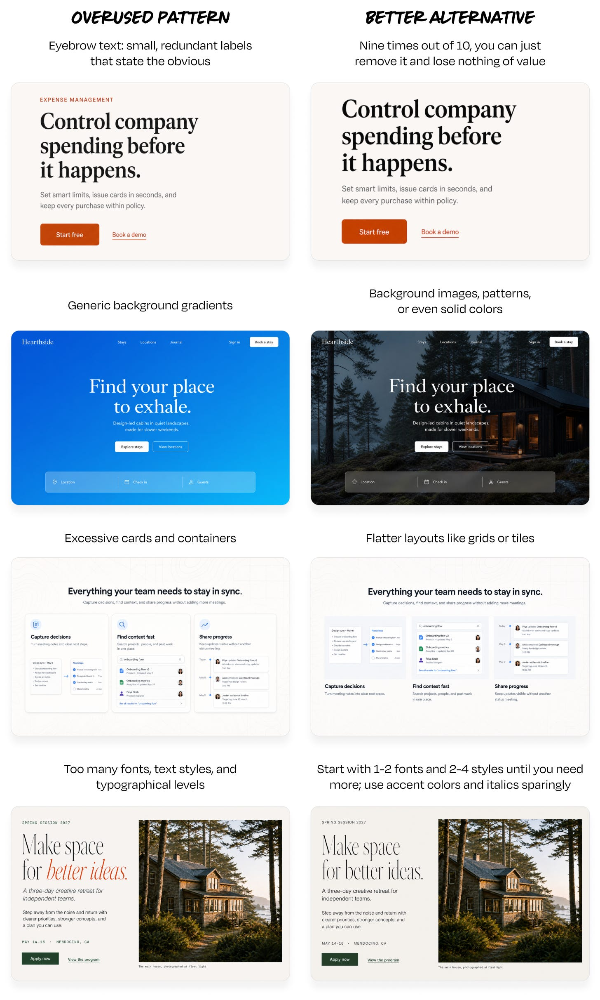

- 처음부터 프롬프트로 금지하는 건 권하지 않는다. 모든 그라데이션이나 카드가 나쁜 건 아니고, 금지하면 AI가 지나치게 고민해 더 이상한 패턴을 만들 수 있다. 다듬는 단계에서 이 목록으로 점검하고 대안을 시도해 비교한다.

## 기법 8: 카피는 직접 다시 쓰기

*Technique 8: Rewrite copy by hand*

- 카피는 비주얼과 별개지만 디자인이 세련돼 보일지 슬롭으로 보일지에 가장 크게 작용할 수 있다. AI 텍스트는 이미 넘쳐 나고, 읽기 피곤하며 부자연스럽다.
- AI 카피는 디자이너의 'Lorem ipsum'처럼 구조를 보기 위한 자리표시자로 보고, 사람이 모든 줄을 읽어 일관된 목소리로 다시 쓴다.
- 비교(그림 25): 데이터베이스 쿼리 분석 제품 Lantern의 홍보 문구다. Claude 버전은 비유와 기술 세부를 길게 늘어놓고, 저자 버전은 제품이 무엇이고 무엇을 해 주는지만 짧게 말한 뒤 무료 연결을 권한다.

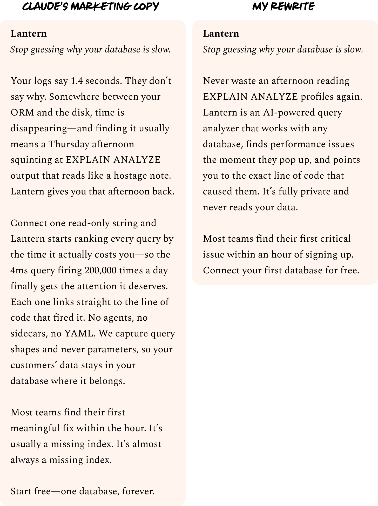

- 사람이 쓴 버전은 거의 언제나 더 짧고 단순하며 덜 거슬린다. AI가 만든 글 덩어리는 사용자가 바로 훑고 넘어가므로, 명확하고 의도된 카피에 공을 들여야 사용자가 실제로 읽는다.
