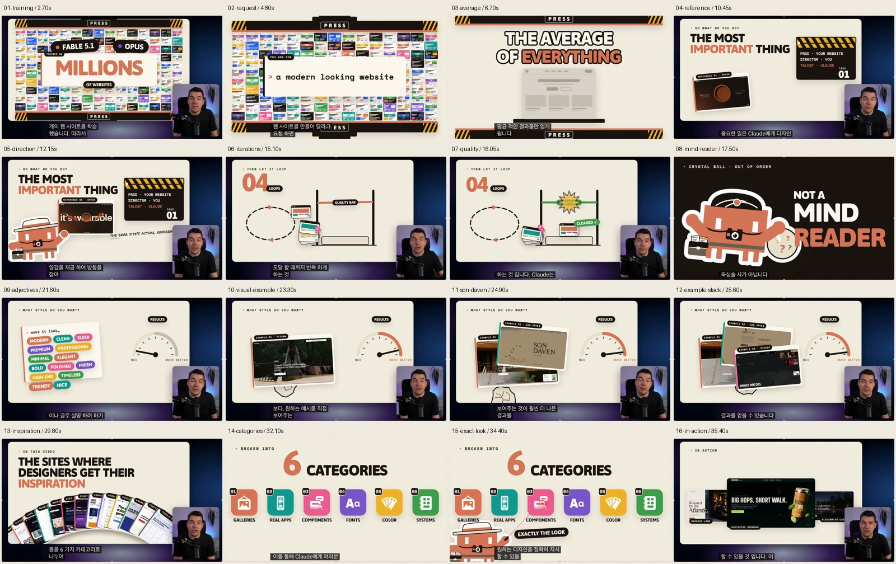

# guide1.mov 캡처와 크롭

[한국어 번역 노트](../../GUIDE_NOTE.md)의 참고 이미지입니다. 원본 영상에서 직접 추출했습니다.

`captures/`에는 2190 × 1224 전체 프레임, `crops/`에는 원래 픽셀 크기를 유지한 직사각형 크롭이 있습니다. 배경과 겹친 요소는 원본 그대로입니다. 기울어진 카드나 가려진 영역을 복원하지 않았습니다.

## 전체 장면

| 시각 | 내용 | 캡처 |
| --- | --- | --- |
| 00:02.70 | 수백만 개의 웹사이트를 학습한 모델 | [01-training.png](captures/01-training.png) |
| 00:04.80 | 현대적인 웹사이트를 요청하는 프롬프트 | [02-request.png](captures/02-request.png) |
| 00:06.70 | 모든 것의 평균 | [03-average.png](captures/03-average.png) |
| 00:10.45 | 사용자가 방향을 정하고 Claude가 구현하는 역할 | [04-reference.png](captures/04-reference.png) |
| 00:12.15 | 실제 참고 사이트를 제시하는 장면 | [05-direction.png](captures/05-direction.png) |
| 00:15.10 | 품질 기준에 도달하기 위한 반복 | [06-iterations.png](captures/06-iterations.png) |
| 00:16.05 | 네 번째 시도에서 품질 기준 통과 | [07-quality.png](captures/07-quality.png) |
| 00:17.50 | Claude는 독심술사가 아니다 | [08-mind-reader.png](captures/08-mind-reader.png) |
| 00:21.60 | 추상적인 스타일 단어로 요청한 결과 | [09-adjectives.png](captures/09-adjectives.png) |
| 00:23.30 | 구체적인 디자인 예시 FLOEMA | [10-visual-example.png](captures/10-visual-example.png) |
| 00:24.90 | 구체적인 디자인 예시 SON DAVEN | [11-son-daven.png](captures/11-son-daven.png) |
| 00:25.60 | FLOEMA, SON DAVEN, STUDIO 예시 | [12-example-stack.png](captures/12-example-stack.png) |
| 00:29.80 | 디자이너가 영감을 얻는 사이트 | [13-inspiration.png](captures/13-inspiration.png) |
| 00:32.10 | 여섯 가지 디자인 참고 범주 | [14-categories.png](captures/14-categories.png) |
| 00:34.40 | 원하는 디자인을 정확히 지시 | [15-exact-look.png](captures/15-exact-look.png) |
| 00:35.40 | 실제 적용 사례 | [16-in-action.png](captures/16-in-action.png) |

## 개별 에셋

| 시각 | 에셋 | 크기 | 파일 |
| --- | --- | --- | --- |
| 00:02.70 | 모델 이름과 학습 규모 | 1165 × 570 | [01-training-claim.png](crops/01-training-claim.png) |
| 00:04.80 | 프롬프트 카드 | 1425 × 455 | [02-modern-website-prompt.png](crops/02-modern-website-prompt.png) |
| 00:06.70 | 평균적인 결과물 도식 | 1290 × 935 | [03-average-result.png](crops/03-average-result.png) |
| 00:10.45 | ORYZO 참고 사이트 | 625 × 445 | [04-oryzo-reference.png](crops/04-oryzo-reference.png) |
| 00:10.45 | 사용자와 Claude의 역할을 보여 주는 슬레이트 | 655 × 470 | [05-director-clapperboard.png](crops/05-director-clapperboard.png) |
| 00:12.15 | 카메라와 모자를 착용한 캐릭터 | 645 × 475 | [06-claude-director.png](crops/06-claude-director.png) |
| 00:15.10 | 반복 작업과 품질 기준 도식 | 1390 × 820 | [07-iteration-diagram.png](crops/07-iteration-diagram.png) |
| 00:16.05 | 품질 기준 통과 도식 | 1390 × 820 | [08-quality-cleared.png](crops/08-quality-cleared.png) |
| 00:17.50 | 독심술사 비유와 캐릭터 | 2085 × 840 | [09-not-a-mind-reader.png](crops/09-not-a-mind-reader.png) |
| 00:21.60 | 스타일 형용사 카드 | 870 × 745 | [10-style-adjectives.png](crops/10-style-adjectives.png) |
| 00:21.60 | 추상적인 요청의 결과 게이지 | 595 × 490 | [11-results-meh.png](crops/11-results-meh.png) |
| 00:23.30 | FLOEMA 사이트 카드 | 880 × 570 | [12-floema-reference.png](crops/12-floema-reference.png) |
| 00:23.30 | 참고 이미지를 제시한 뒤의 결과 게이지 | 595 × 490 | [13-results-better.png](crops/13-results-better.png) |
| 00:24.90 | SON DAVEN 사이트 카드 | 820 × 570 | [14-son-daven-reference.png](crops/14-son-daven-reference.png) |
| 00:25.60 | 세 가지 웹사이트 예시 묶음 | 1090 × 765 | [15-reference-stack.png](crops/15-reference-stack.png) |
| 00:25.60 | STUDIO 사이트 카드 | 715 × 500 | [16-studio-reference.png](crops/16-studio-reference.png) |
| 00:29.80 | 디자인 참고 사이트 카드 모음 | 1625 × 510 | [17-inspiration-sites.png](crops/17-inspiration-sites.png) |
| 00:32.10 | 여섯 가지 범주 전체 | 2145 × 800 | [18-six-categories.png](crops/18-six-categories.png) |
| 00:32.10 | 01 갤러리 | 320 × 380 | [19-category-galleries.png](crops/19-category-galleries.png) |
| 00:32.10 | 02 실제 앱 | 320 × 380 | [20-category-real-apps.png](crops/20-category-real-apps.png) |
| 00:32.10 | 03 컴포넌트 | 320 × 380 | [21-category-components.png](crops/21-category-components.png) |
| 00:32.10 | 04 글꼴 | 320 × 380 | [22-category-fonts.png](crops/22-category-fonts.png) |
| 00:32.10 | 05 색상 | 320 × 380 | [23-category-color.png](crops/23-category-color.png) |
| 00:32.10 | 06 시스템 | 320 × 380 | [24-category-systems.png](crops/24-category-systems.png) |
| 00:34.40 | 원하는 모습 그대로라는 문구 | 575 × 165 | [25-exactly-the-look.png](crops/25-exactly-the-look.png) |
| 00:35.40 | SOUTHSIDE BREWING 웹사이트 | 900 × 550 | [26-southside-brewing.png](crops/26-southside-brewing.png) |
| 00:35.40 | HARBOUR LANE, SOUTHSIDE BREWING 등 적용 사례 | 1575 × 575 | [27-in-action-sites.png](crops/27-in-action-sites.png) |

## 추출 정보

시각과 크롭 좌표, 파일 크기, SHA-256 해시는 [manifest.json](manifest.json)에 기록했습니다. 전체 프레임에는 영상에 원래 표시된 자막과 발표자, 녹화 테두리가 포함됩니다. 원본 자체가 다른 요소에 가려진 부분도 그대로 남습니다.

다시 추출: `python3 scripts/extract_guide1_assets.py` (프로젝트 루트에서 실행).
